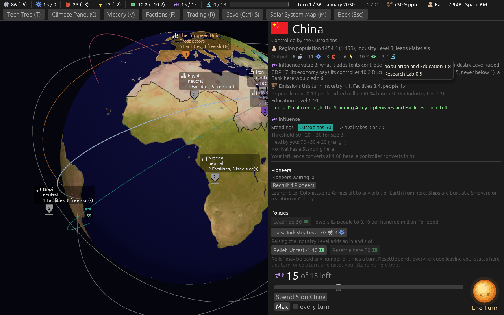
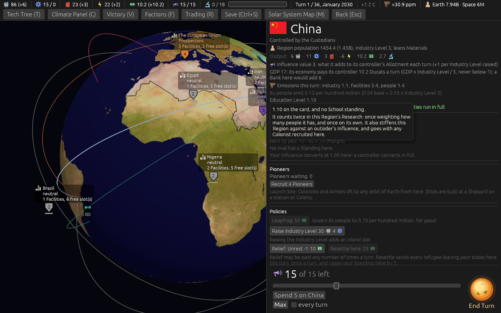
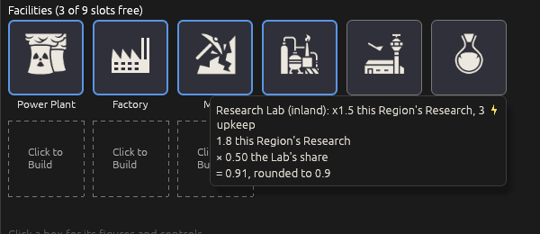

# Research from every Region's people and schooling (ticket #416)

[Ticket #416](https://github.com/whaleyjoshua2/Dying-Earth/issues/416); the spec is §15 of
[`docs/spec/version-0.09.4.md`](../../../spec/version-0.09.4.md). Decided in four rounds: *"q1 a| a
compleation rate of 60/80 would be ideal ... q2 b q3 a q4 yes"*, *"q5 1/1.5 q6 yes q7 let's apply the
same rules to neutral but at .5 q8 ok q9 ok"*, and, the rounding corrected, *"q10 leave it"*.

## The measure first

The sweep recorded the game's last turn as the tree's finish. It now records the turn the last Tech
completed, each Tech's turn, and the world's Research by source
([`416-measure.txt`](../sweeps/416-measure.txt)): the tree complete in 47 of 80 games, median turn
28; Research 35.4 a turn, Labs 20.7, Observatories 14.0. Of the 55 games still running at turn 28,
46 had the tree complete: collapse takes 25 of the 33 that never finished.

## The candidates

[`416-candidate-*.txt`](../sweeps/) were swept with each Lab's share rounded down on its own, which
lost a small Region's Lab entirely. [`416-rounded-once-*.txt`](../sweeps/) are the same with the
seat's Research settled whole once:

| base / Lab x | Tree done | median turn | Research a turn | collapses |
|---|---|---|---|---|
| 0.6 / 1.5 | 27 | 29 | 33.4 | 64 |
| 0.7 / 1.5 | 51 | 28 | 36.9 | 50 |
| 0.8 / 1.5 | 59 | 26 | 40.6 | 54 |
| 0.7 / 2.0 | 61 | 26 | 42.0 | 51 |
| **1.0 / 1.5 (built)** | **76** | **24** | **48.9** | **38** |

## The pictures

China on turn 1 (`shot: select:eastasia "tip:population and Education" panel:0 seed:7 cardshut:1`):
no Lab, *population and Education 1.8*.

With a Lab (`lab:1`, a new building aid): *population and Education 1.8, Research Lab 0.9*, the row
2.7; the Education hover names *this Region's Research*.

The Lab's box (`window:1400x1700 lab:1 "tip:the Lab's share"`): *x1.5 this Region's Research*, then
*1.8 this Region's Research, x 0.50 the Lab's share, = 0.91, rounded to 0.9*. It first carried the
Region's whole chain and rendered seven lines; it starts from the Region's figure now.

## The red witness

Three mutations, each watched red and restored: a Lab's share floored on its own (three tests,
*"the Lab's 0.9 counts"* among them); the neutral share ignored (the neutral test); Unrest 7 not
halving a Region's own (the Region test).

## The review

An agent that did not build it found the arithmetic sound: a Region's own and a Lab's share each
halved once at Unrest 7, the seat's figure settled whole once, the occupier taking the Region's own,
the old Lab path gone from every reader. Fixed from it: Public Science and The Upload's text now say
*Region and Lab Research*; the Directive's lines say *your Research*, not *your Labs*; a neutral Lab's
box shows its own share for the world, not its Region's whole figure; tests for the Output hover's
two lines, one neutral Lab's share, and a neutral Region at Unrest 7; stale comments. Put to the
designer: a Drought, a Storm Surge, a card's Facility cut and a Strip Permit reach only a Lab's
share now, not the Region's own; the computer seats still skip a School where no Lab stands.
The sweep reads a Tech's turn after the turn's end, one past the turn it completed, as its other
measures do. The closing sweep is [`after-416.txt`](../sweeps/after-416.txt).
