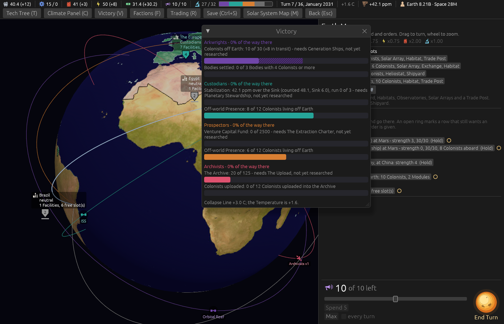

# The Victory window's bars in the Faction's colour (ticket #418)

[Ticket #418](https://github.com/whaleyjoshua2/Dying-Earth/issues/418), added by the designer during
the version; the spec is §11 of [`docs/spec/version-0.09.4.md`](../../../spec/version-0.09.4.md).
Decided in one round (*"q1 yesh q2 sounds good"*). No rule moves; a colour, so no test.

**The Victory window at turn 15**, `shot: victory:1 panel:0 turns:14 seed:7 cardshut:1
window:1400x900`: the Custodians' bars teal, the Prospectors' orange, the Arkwrights' purple, the
Archivists' pink, each its heading's colour. No Colonists were in transit in this game, so the
darkened band is not pictured; it is darkened from the same fill.

## The review, and the band

An agent that did not build it found no defect, and asked that the in-transit band be seen in a
Faction's colour, the Arkwrights' purple darkened being the faintest against the empty bar.
`shot: player:arkwrights victory:1 settler:mars turns:6 cardanswer:refuse panel:0 seed:7`: the
Arkwrights' first bar, *10 of 30 (+8 in transit)*, the band beyond the fill reading plainly as purple
hatching.

