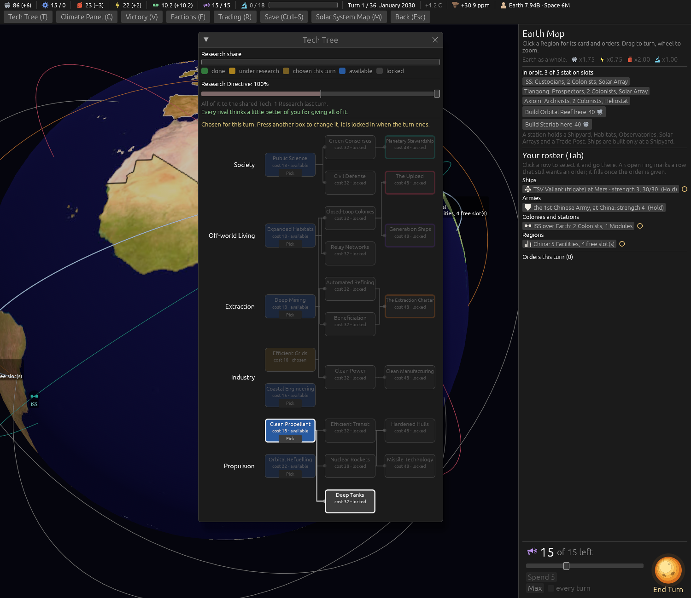
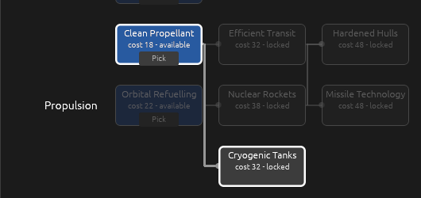

# Bigger tanks: Colony Ships at 40, and Deep Tanks (ticket #420)

[Ticket #420](https://github.com/whaleyjoshua2/Dying-Earth/issues/420); the spec is §16 of
[`docs/spec/version-0.09.4.md`](../../../spec/version-0.09.4.md). Decided in one round (*"q1 ok q2 ok
q3 yes q4 a q5 no q6 ok"*).

## The picture

The tree with Deep Tanks hovered, `shot: tech:1 panel:0 seed:7 cardshut:1 window:1500x1300
techhover:deep_tanks`: it stands on Propulsion rung 2 under Nuclear Rockets, its line from Clean
Propellant lit.

## The red witness

`deep_tanks_adds_fifteen_to_every_tank_on_clean_propellants_five`: red with Deep Tanks' Fuel left
out of `tank_of` (*(45, 35, 35) against (60, 50, 50)*), green after.

## The sweep

[`after-420.txt`](../sweeps/after-420.txt) against [`after-416-schools.txt`](../sweeps/after-416-schools.txt):
Deep Tanks completed in 80 of 80 games, median turn 15; wins 7 / 9 / 3 / 17 to 10 / 10 / 0 / 14;
collapses 43 to 46; ground Colonies on the Moon at the end 255 to 222.

## The review

An agent that did not build it found the engine correct: every tank reader goes through `tank_of`,
the computer seats route only Colony Ships on its largest tank, saves load with the Tech appended.
Fixed from it: the test doc comment put back on the tree-cost test; the `shot:` boards build their
Colony Ships with a full tank of 40, not 30; two stale comments.

## Renamed

At the designer's word the Tech is **Cryogenic Tanks** (`cryogenic_tanks`, `TechId::CryogenicTanks`);
the picture and the sweeps above were taken under its first name, Deep Tanks.

