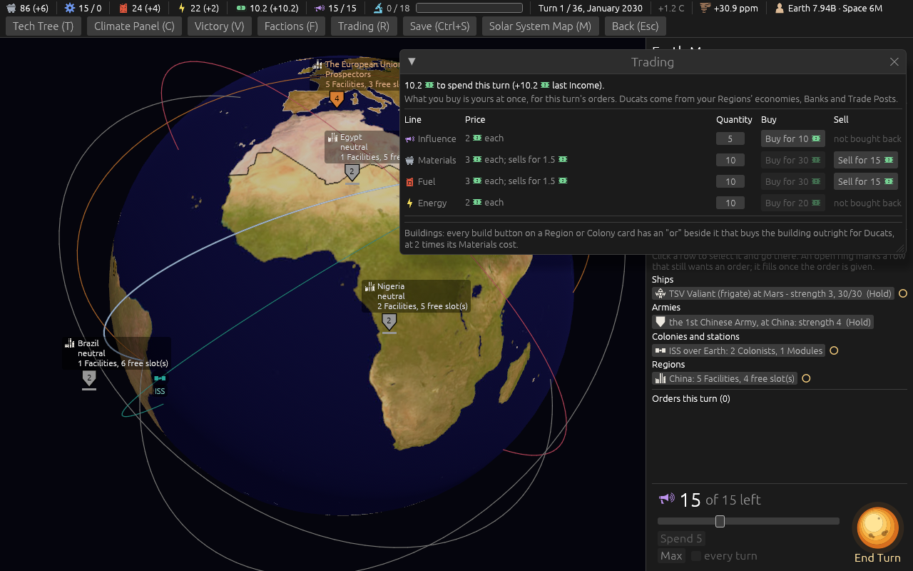
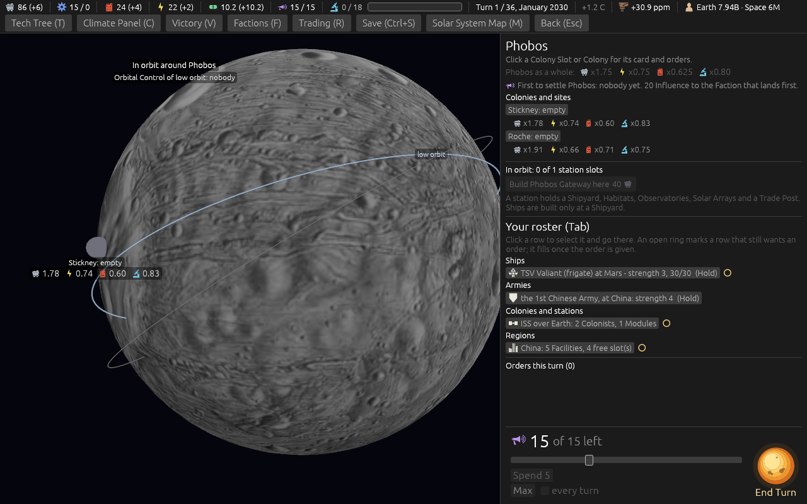

# Cheaper Fuel: Refineries, small bodies and the market (ticket #421)

[Ticket #421](https://github.com/whaleyjoshua2/Dying-Earth/issues/421); the spec is §17 of
[`docs/spec/version-0.09.4.md`](../../../spec/version-0.09.4.md). Decided over four exchanges, the
candidates swept first (the table is on the ticket).

## What the sweeps showed first

The computer seats never bought Fuel on the market and built few Refineries off Earth, so a price cut
and the off-Earth figures moved nothing in the sweep: the run with Fuel at 3 was identical to the one
without it. The designer then asked for the computer seats to buy Fuel (*"q1 a"*).

## The red witness

`the_ai_buys_fuel_for_a_colony_ship_or_a_refuel`: red with the purchase switched off (*"40 wanted,
10 held: 30 bought"*), green after. The pinned figures that moved: a Refinery 4 and 6 under Automated
Refining; a Moon Refinery Module 3.1, doubled 6.2; Fuel 3 Ducats, sold 1.5, the Prospectors 12.8 for
five.

## The sweep

[`after-421.txt`](../sweeps/after-421.txt): Moon ground Colonies 222 to 229; first Moon Colony 69 to
71 of 80; stranded 34 to 41; collapses 46; wins 8 / 7 / 2 / 17.

## The picture

The trading window on turn 1 (`shot: trade:1 panel:0 seed:7 cardshut:1`): Fuel 3 each, sells for
1.5; the top bar's Fuel +4 from China's Refinery.

## The review

An agent that did not build it found the Buy-plus-Refuel could never be taken: a Refuel was priced at
the Stockpile as it stood, so behind a purchase from an empty Stockpile it was refused, and a later
order could spend the Fuel it would take (a queue that committed to -1 Fuel). And the test could not
fail: it matched the log line of a refusal. Fixed: a Refuel is priced at what the queued orders leave,
in the check and in `remaining`; the plain Refuel stays on offer beside the bought one; the test
checks the pricing, a queue that would have gone below nought, and the computer buying then refuelling,
each watched red with its half of the fix undone. The Body card prints a yield to as many places as it
has, up to four, so Phobos reads x0.625:

Swept again ([`after-421.txt`](../sweeps/after-421.txt)): Refuel orders 472 to 520; Moon ground
Colonies 228; first Moon Colony in 72 of 80; stranded 43.
