# Version 0.09.8, the Moon race version

The map is [#473](https://github.com/whaleyjoshua2/Dying-Earth/issues/473); the spec is
[`docs/spec/version-0.09.8.md`](../../spec/version-0.09.8.md). One entry per ticket, in the order
they were built.

## Card sub-headers (#474)

The designer: *"for the nation/outpost cards increase the size of each sub-header by 15%, e.g.
Influence, Pioneers, Policies. Influence should share the same white color. add a break between
policies and facilities and like influence I want to see a glyph leading each heading."*

Decided on the ticket: every sub-header on both cards, with the Colony card's Modules and Influence
lines promoted to headings; 14.5 points; white for all; the rule below the Policies block.

Each picture is the 0.09.7 build on the left and this build on the right, the same seed (7), turn 4,
at `window:1280x1500` so the whole card shows.

- **The Region card** (`select:EastAsia turns:3 seed:7`):
  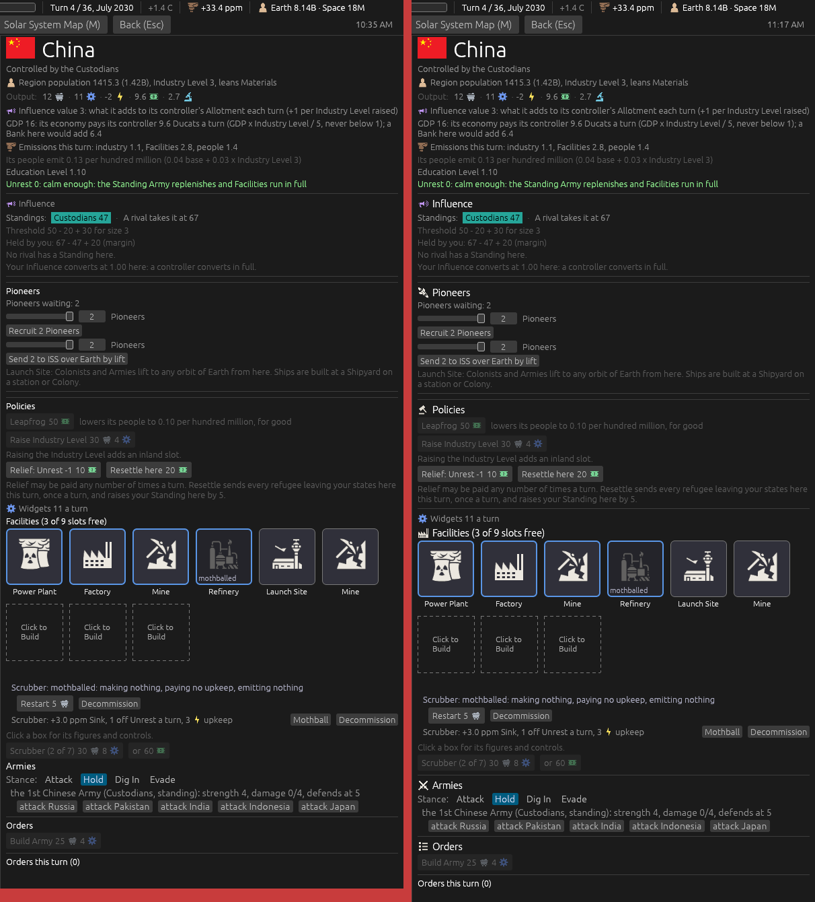
- **The Colony card**, the ISS (`hab:1 turns:3 seed:7`):
  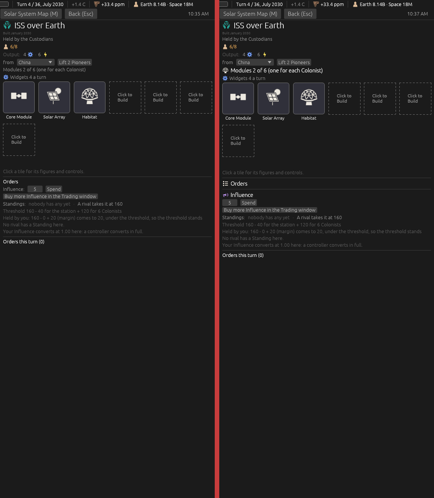
- **The Archivists' Colony card**, for The Archive's heading (`hab:1 player:archivists archive:1`):
  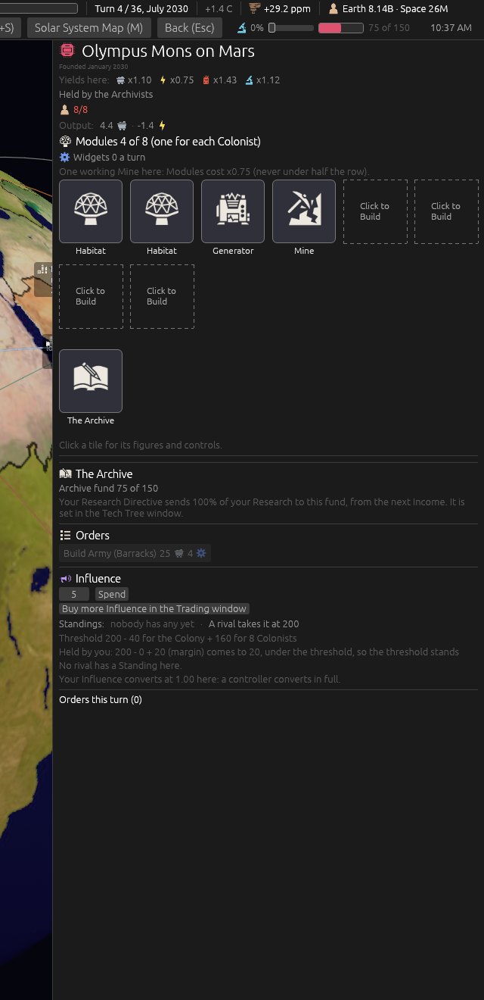
- **The headings at four times their size**, to judge the glyphs. Policies' gavel and Orders' list
  are new drawings (`assets/icons/policies.svg`, `orders.svg`):
  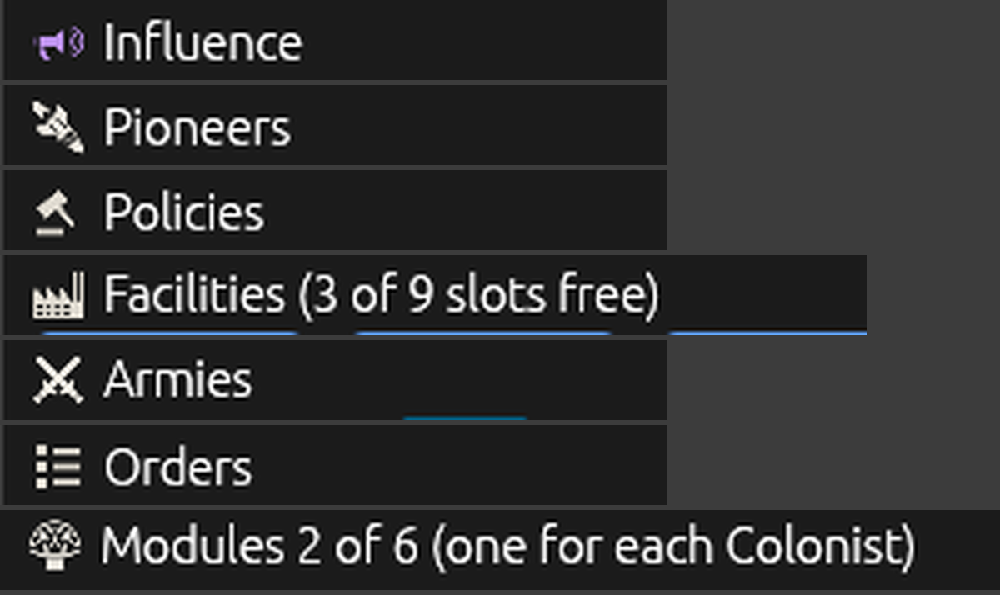

**After the designer looked:** *"policies looks a bit wonky at its size - replace, also we need a line
before the armies section"*. Policies was a scroll first. Four replacements were drawn and previewed
at 17 pixels (a preview drawn by script, not by the game's own renderer); the gavel went into the
build. A rule now stands above the Armies block on both cards.

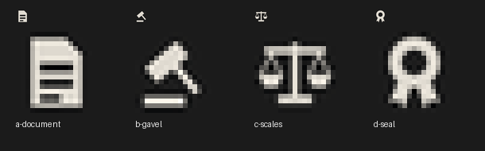

Seen in the pictures and left alone:

- The Region card is about 30 pixels taller for the larger headings and the new rule.
- On a station with no Shipyard the Orders heading has nothing under it. It was so before; the
  larger heading makes it plainer.

Not pictured: the Ships heading (no Shipyard on these boards), the Colony card's Armies heading, and
the full-place warning under Modules.

## The population and GDP lines on the cards (#475)

The designer gave both lines word for word. Decided on the ticket: the figures cut from the GDP line
go onto its hover; the Colony card's bracket counts the part-grown next Colonist; the amber and red
stay on the count.

The left of each pair is the build after the sub-headers ticket, the right this build, seed 7, turn 4.

- **The Region card** (`select:EastAsia turns:3 seed:7`):
  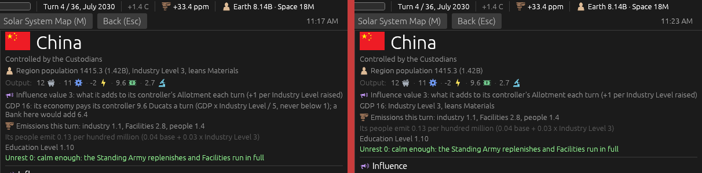
- **The GDP line's hover** (`tip:Pays`):
  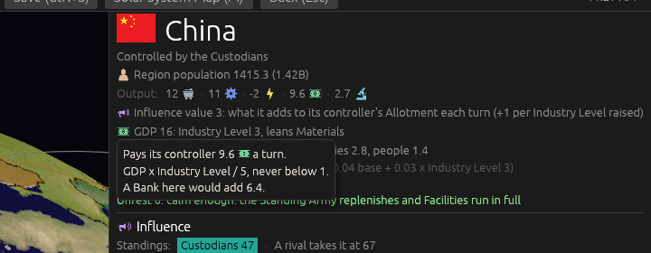
- **The Colony card**, the ISS (`hab:1`): six Colonists and three tenths of a seventh.
  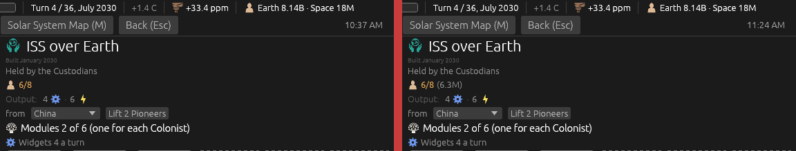

Not pictured: the hover on a rival's Region the player cannot see.

## Raise Industry Level as a tile (#476)

The designer: *"get rid of the raise industry level button, instead add an empty tile that says
raise industry level; when clicked it changes to click to build and procs another such box at the
end."* Decided on the ticket: the rule stands, so the tile is drawn *"just like any building being
built"* until the raise completes; last of the tiles; one click orders it.

China, seed 7, turn 4 (`select:EastAsia turns:3 seed:7`). A new aid, `raise:1`, gives the seat
Materials and places the order.

- **Free, and refused**: the seat holds 21 Materials of the 30, so the tile is greyed and the
  refusal leads its hover (`"tip:Adds an inland"`):
  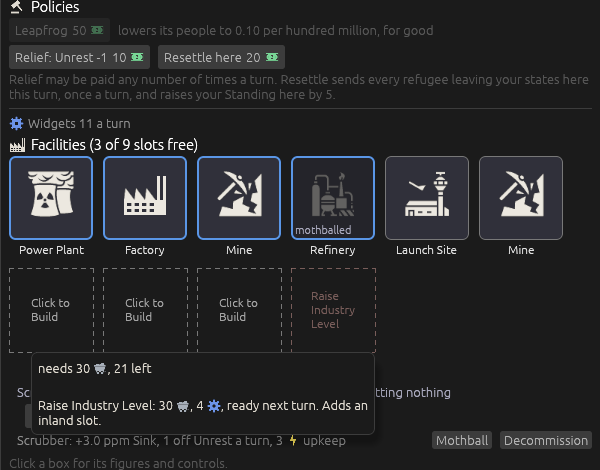
- **Ordered** (`raise:1`):
  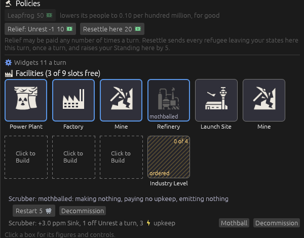
- **Its hover while ordered** (`raise:1 "tip:ordered this turn"`):
  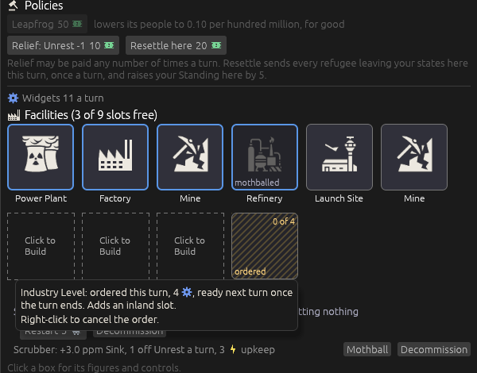
- **After End Turn** (`raise:1 commit:1`): a fourth free box, and a new Raise tile after it. A card
  of the new turn overlaps the left of the picture.
  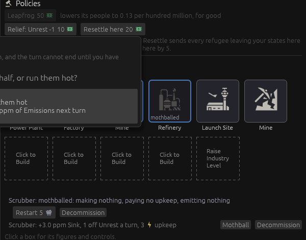

**After the designer looked:** *"can we shift the color maybe something closer to the mothballed blue
shade or a red version of the same tone"*. Both were built and shot, live and greyed; the designer
took the red. The tile's words and dashes wear it, dimmed where the order would be refused.

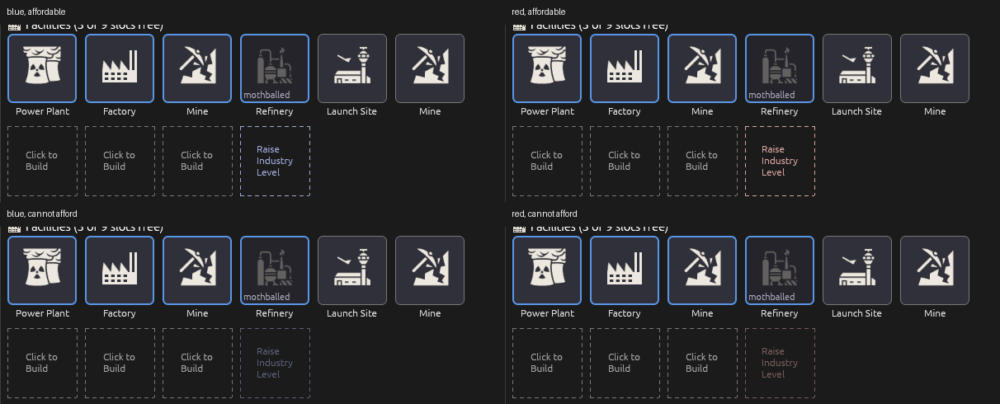

- **Live, in the red** (`raise:afford`):
  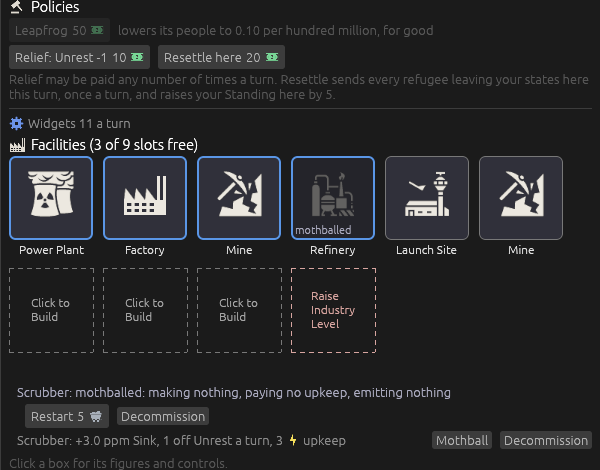

Not pictured: the raise under way across a turn ("building,
2 of 4"), which needs a Region making fewer than 4 Widgets a turn.

## The tutorial, 10% fewer words (#477)

462 words to 398. The designer approved the seven cuts as a before-and-after table on the ticket,
and declined a tested ceiling: *"nah we need some flexibility here"*.

The four notes that changed, as the game draws them (`menus:1 tutorial:<turn> seed:7`): turns 1 and
2 above, 3 and 5 below.

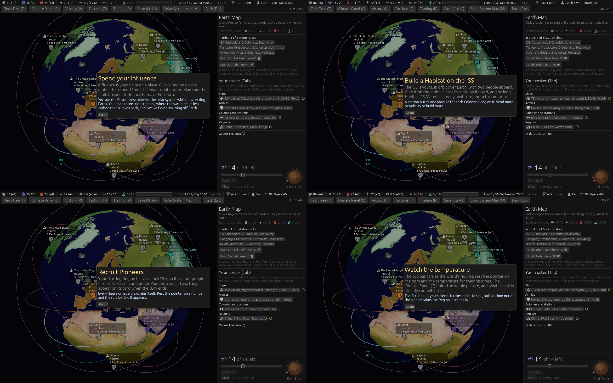

## The Prospectors' Opening Objective: 50 Ducats, three turns running (#478)

Decided on the ticket: three Incomes in a row, a turn with one Bank not working starts the count
again; still three different Regions; the Journal shows the count.

**Witnessed red:** the new test `the_prospectors_opening_objective_wants_three_turns_running` and
the amended `each_faction_has_an_opening_objective_met_once_and_rewarded`, written before the rule,
both failed with the objective met at the first Income (`left: (Some(1), 0)`). The first build then
failed the new test on its own premise: the Fund grows a little each Income by itself, so the test
now measures the 50 on top of that growth.

**The Journal's count** (`player:prospectors victory:1 journal:1 openingrun:2`; `openingrun:` is a
new aid that sets the count):

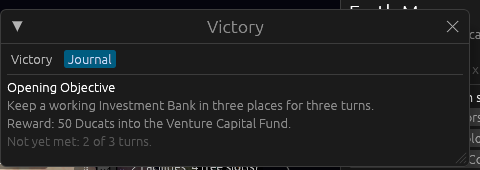

**The sweep** ([`after-478.txt`](sweeps/after-478.txt)): 8 / 19 / 20 / 4 and 29 collapses, from
8 / 21 / 18 / 5 and 28. Within noise. The Prospectors meet their objective in 51 of 80 games, from
58, by seating 20 / 20 / 6 / 5 from 20 / 20 / 9 / 9, at a median turn one or two later.

**The sweep's command and time, for the record:** `cargo run --release -p dying-earth-engine
--example sweep -- 20 --seatings --steps=300 --balance`; the 80 games took 11 seconds, measured.

## Raise Industry Level at a rising price (#479)

Decided on the ticket: counted by the Region's levels above its card; the Prospectors pay half the
Materials at every step; no new words.

**Witnessed red:** the new test `raising_industry_costs_more_with_every_raise_standing_in_the_region`
was run with the three steps at nought in the data and failed at the second price
(`left: (30.0, 4)`, `right: (40.0, 5)`); it passed when the steps were set.

**The tile's hover at the second price** (`raise:1 commit:1 "tip:Adds an inland"`), China one raise
above its card:

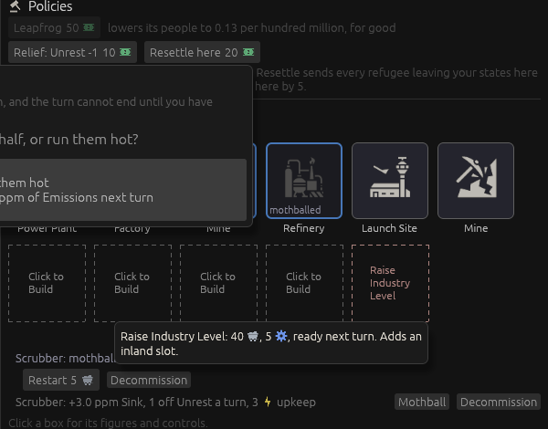

**The sweep** ([`after-479.txt`](sweeps/after-479.txt)): 8 / 19 / 17 / 5 and 31 collapses, from
8 / 19 / 20 / 4 and 29. Within noise. The sweep gained a line this ticket, the Industry Level raises
the Factions completed: 1,627 over the 80 games, against 1,895 at the flat price (by seating 157 /
733 / 302 / 435 from 188 / 920 / 332 / 455). The flat-price run, with the steps at nought, matched
`after-478.txt` line for line apart from the new line, so the count itself moves nothing.

## Earth L4 and Earth L5 (#480)

The designer's answers turned two extra slots into a new kind of place: farther out (8 Fuel),
reached only by Ship, founded by a Colony Ship as a Venus station is, the Sun's pair of points
rather than the Moon's, and taught to the computer seats.

**Witnessed red:** `earth_l4_and_l5_are_far_orbits_reached_only_by_ship` and
`the_ai_founds_at_a_far_orbit_once_the_ordinary_slots_are_taken` were run with `far_slots` at nought
in the data and both failed; they pass with it at 2. Two older tests that count Earth's slots and
orbits were re-based (5 to 7, 20 to 22).

**Drawn, then undrawn.** The first build put the two on Earth's Surface Map as clickable points off
the globe. The designer, mid-build: *"these don't need to be clickable points on Earth's map btw"*,
then *"they don't even have to be plain markers"*. They are not on that map at all now.

- **The Solar System Map**, empty on the left and Earth L5 held on the right (`farstation:2`, a new
  aid that plants a station and a Frigate there):
  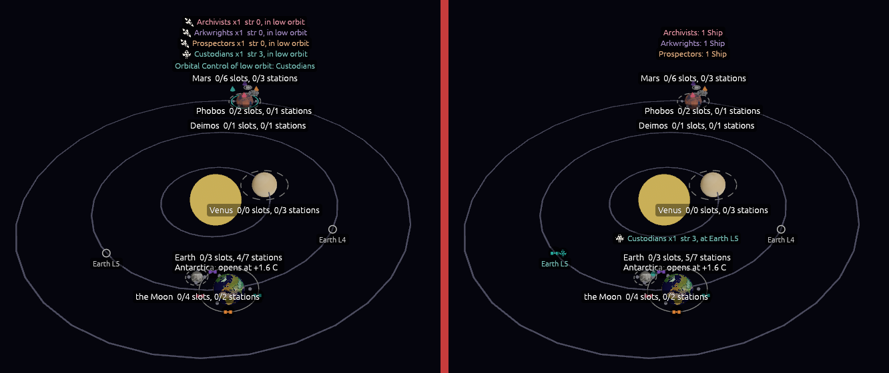
- **Earth's map and planet card**: no marker for either, and the card's two lines for them:
  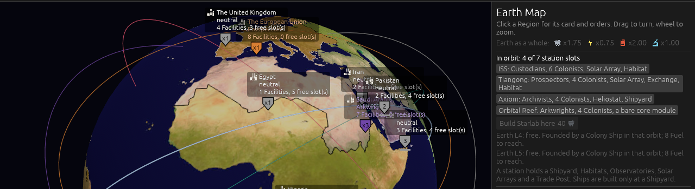
- **A far station's card** (`farstation:1 hab:1`):
  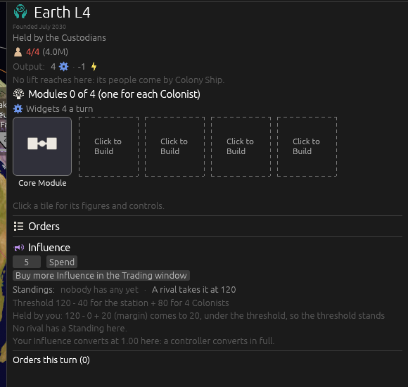

**The sweep** ([`after-480.txt`](sweeps/after-480.txt)): 8 / 19 / 17 / 3 and 33 collapses, from
8 / 19 / 17 / 5 and 31. Within noise. The sweep gained a line, stations founded at Earth L4 or L5:
**one in the 80 games**. The computer seats go there only when the five are taken and a loaded
Colony Ship at Earth has nothing better to do, which is rare.

Not pictured: the Ship card's "To Earth L4" door and its 8 Fuel; the greyed lift.

## Fuel scaled to real delta-v (#485)

Added by the designer during the L4 ticket: *"add a ticket to scale fuel requirements with real life
delta v requirements"*.

**The research** is [`docs/research/delta-v.md`](../../research/delta-v.md), done by an agent in two
passes. The first found that with full aerocapture the real cost from Earth orbit is nearly the same
everywhere, Mars and Venus cheaper than the Moon. The designer: *"seems an over estimate if erases
any delta-v differences from the moon"*. It was the optimistic end: aerocapture has never been
flown. The second pass priced **aerobraking as flown**, checked against mission records (Mars
Reconnaissance Orbiter's capture burn 1,015 m/s, Venus Express's 1,251 m/s), and that is what the
game uses. My remembered Venus figure of 4.8 was wrong; like for like it is 4.4.

**The scale.** Three candidates were swept with whole-number Fuel before the designer chose (the
Moon kept at 6, Mars kept at 20, and between); all three were within noise of the standing win
column. The designer took Mars at 20, rounded up to 4.5 Fuel a km/s; then, the build in hand, asked
for 4.0 swept beside it (*"can you drop the conversion rate to 4 and rerun"*), and chose 4.0.

**Witnessed red:** the change itself turned ten older tests red, each quoting an old price; they
were re-based one figure at a time. The new test `a_legs_fuel_is_its_real_delta_v_times_the_scale`
was run against the wrong scale and failed (`left: 4.0, right: 4.5`). Re-basing to 4.0 then caught a
real fault: a Mass Driver's cut left `14.399999999999999` where 14.4 was meant, so its result is
rounded to the tenth now.

**A Colony Ship's card at Earth**, turn 4 (`stack:earth ship:1`): the Moon at 16, the far orbits at
16, and Mars (32.3) and Venus (40.7) off their windows.

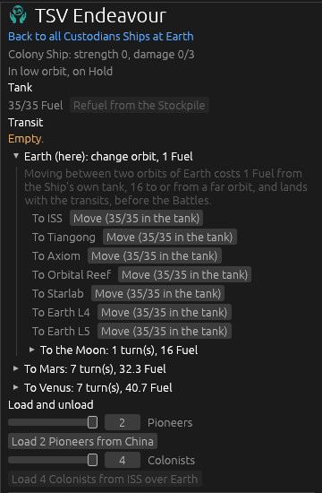

**The sweep** ([`after-485.txt`](sweeps/after-485.txt)), at 4.0: 7 / 20 / 17 / 4 and 32 collapses, from
8 / 19 / 17 / 3 and 33. Within noise. At 4.5 it read 8 / 21 / 17 / 1 and 33. Ships stranded at the
end of a game: 15 over the 80 at 4.0, 13 at 4.5, 3 before.

## Every leg of every journey priced the same way (#486)

Added by the designer on closing #485: *"add a ticket to make the legs of all journeys calculated
the same way (earth has aero breaking). That way we can go from L5 to venus etc."*

**The research** is section 3.9 of [`docs/research/delta-v.md`](../../research/delta-v.md): a table
of every pair of the eight places, each direction, all computed. The agent then tested whether a
few figures a place reproduce it: a leave and an arrive figure each, and a gulf for each pair of
systems. They do, to 0.18 km/s at worst (one far orbit to the other) and 0.01 nearly everywhere, so
that is the model.

**Decided on the ticket:** the far orbits are places of their own for travel; every pair is flown;
Earth's air brakes the way home, as flown (unflown at Earth, as at Venus, and the designer kept
it); a trip to a far orbit still takes one turn where two years is real; every crossing has a
window the same way.

**Witnessed red:** the change turned nine older tests red; eight quoted a price and were re-based,
and one was a computer seat choosing a different order (below). The new test
`every_journey_is_priced_the_same_way_each_direction_for_itself` was run with Earth's arriving figure
set to its leaving one and failed on Venus to Earth (`left: 27.2, right: 16.6`).

**A computer seat changed its mind.** `the_computer_bombards_with_cause_and_the_orbit_held` failed:
its Battleship at Mars, full tank, now flies home to blockade the rival's station, the homeward leg
being 12.1 where it was past the tank off its window. The test now gives the hull 10 Fuel, short of
the leg, and it bombards as before.

**A Ship's doors**, turn 4: a Colony Ship in low Earth orbit on the left, a Frigate at Earth L5 on
the right (`farstation:2 stack:earth ship:1`). From L5 the Moon is 7.2 where from Earth it is 15.7,
and Venus is five turns at 24.3 where from Earth it is seven at 40.3, its window being nearer.

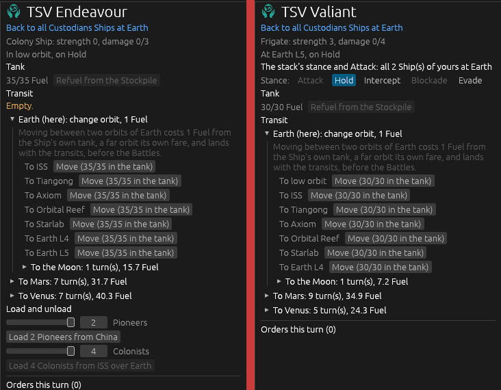

**The Mass Driver at a quarter.** Shown that a flat 4 Fuel now took the Moon's way home to its
floor, the designer asked: *"can mass drivers be a flat 25% off fuel requirements"*. Built. The
test was changed first and could not compile until the rule's figure existed, so its red is a
compile error and not a failing assertion; its figures (2.8, 6.8, 2.1) are ones the old rule did
not give (1.0, 5.0, 1.0).

**The sweep** ([`after-486.txt`](sweeps/after-486.txt)): 7 / 21 / 16 / 4 and 32 collapses, from
7 / 20 / 17 / 4 and 32. Within noise. Ships stranded at the end: 3 over the 80 games, from 15. The
Mass Driver's change left it the same to the line: the computer seats build none (0 standing at the
end of all 80 games).
