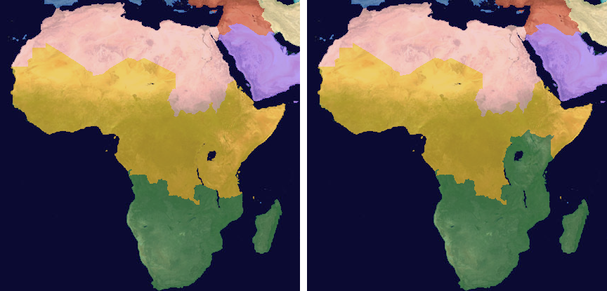

# Version 0.09.9, the settlement version

The map is [Map: version 0.09.9](https://github.com/whaleyjoshua2/Dying-Earth/issues/488). The
standing baseline is 0.09.8's closing sweep: 9 / 27 / 18 / 7 (Custodians / Prospectors / Arkwrights
/ Archivists) and 17 collapses in 80 games.

## Four Colonists to found (#489)

Every new Colony or station opens with four Colonists, however it is made: a Colony Ship's Unload,
Pioneers by sea, or a build from a Launch Site, a Colony or a station, which gives them up and keeps
as many as its Modules, never fewer than four. The Arkwrights start with four Pioneers, from two.
Spec section 1.

**The pictures.**

- [`ticket-489/arkwrights-station-turn-one.png`](ticket-489/arkwrights-station-turn-one.png): the
  Arkwrights on turn 1. Earth's card offers "Build Orbital Reef here 20 [Materials] 4 [people]",
  live.
- [`ticket-489/station-needs-four.png`](ticket-489/station-needs-four.png): the Custodians on turn 1,
  nobody waiting. The same button greyed, its hover "needs 4 [people]".

**The sweep** ([`after-489.txt`](sweeps/after-489.txt)): 0 / 24 / 33 / 6 and 16 collapses, from
9 / 27 / 18 / 7 and 17. Far past noise.

- **Stations off Earth at the end** over the batch: 36, from 94. The Moon 1 from 26, Deimos 6 from 40,
  Venus 29 from 25.
- **The Arkwrights' Opening Objective** (a Colony on the Moon) is met in 55 of 80 games, from 29.
- **The Custodians win none.** Traced on seed 1 with the Arkwrights in seat 0: on both builds the
  Custodians have twelve off Earth by turn 8; on 0.09.8 they hold Stabilization on turns 26 to 28 and
  win, here they never do and the Arkwrights win on turn 30. The two games part on turn 10 through a
  different Tech pick, then different cards and fewer Materials (47 against 77 on turn 12), fewer
  Regions (10 against 12 on turn 22) and fewer Scrubbers (6 against 9 on turn 28). A chain, not a
  single cause;
  **not traced further.**

**A lock found and fixed.** Run once with the Arkwrights starting at two Pioneers, they won 1 game in
80 and met their objective in 0 to 6 games a seating. The computer recruits only with room to put
people; with no station, a station-less seat had none, so it never recruited the four a station now
takes and never built one. The computer now counts the station it could build as room for four.
At two Pioneers with the fix: 5 / 23 / 24 / 5 and 23 collapses. At four, as shipped, the fix changes
no game: 0 / 24 / 33 / 6 and 16.

**The review** (two agents, standards and spec, neither of which built it) found: a Load or Send
Down could order people a build had already claimed, and fail quietly at the Resolution; a founding
settled four whatever had left; the UI decided which orders take people; a long refusal; the
computer recruiting four for a station with no Launch Site to build it from; a short founding
skipped with no line. All six fixed, the first two with tests watched failing first. Kept: four
from a Colony that changed hands in the turn are lost, not handed to its captor. The sweep after
the fixes is the same to the line.

**The sweep's command:** `cargo run --release -p dying-earth-engine --example sweep -- 20 --seatings
--balance`.

## Colony tiers: Outpost, Settlement, Colony (#490)

Every Colony and station stands at a tier, an Outpost to start; its Module slots are the lower of
its Colonists and the tier's cap, 6, 12 or 18; the next tier is a build through its Widgets queue,
30 Materials and 4 Widgets at 12 Colonists, 50 and 6 at 18. Spec section 2.

**The pictures.**

- [`ticket-490/outpost-card.png`](ticket-490/outpost-card.png): the ISS on turn 1, "ISS over Earth
  Outpost", Modules 1 of 2, and after the free box the dashed red Upgrade tile, "Settlement" under it.
- [`ticket-490/upgrade-needs-twelve.png`](ticket-490/upgrade-needs-twelve.png): its hover, greyed:
  "needs 12 [people]", then "Upgrade to a Settlement: 30 [Materials] and 4 [Widgets]. Up to 12 Modules."

**The sweep** ([`after-490.txt`](sweeps/after-490.txt)): 3 / 26 / 26 / 4 and 20 collapses, from
0 / 24 / 33 / 6 and 16 after the founding rule. The Arkwrights' fall of seven is past noise, not
traced. The sweep gained a line, places at the end by tier: 929 Outposts, 81 Settlements, 22
Colonies of 1,032.

The Report's word ceiling rose by two, to 1,783, for a rival's "upgraded {colony}".

**The review** (two agents, standards and spec): a Module refused at the tier's cap still blamed the
people ("one for each of its 14 Colonists"); it now says "full: upgrade to a Settlement for more",
test watched failing first. Also fixed: the free tile's hover stated the old rule; the Modules
hover wrote "one a Colonist" where the data holds the figure; the tiers check sat under another
ticket's comment; the queue test written three times. Kept: a tier build under way when the place
changes hands completes for the new holder, as a Module does. The sweep is the same to the line.

## The Prospectors' Bank paying interest off Earth (#491)

The Exchange pays an Investment Bank's interest, one share for each Colony or station with a working
one, as a Region with a Bank counts; captured, it pays its captor as a captured Bank does. Spec
section 3.

**The picture.** [`ticket-491/exchange-hover.png`](ticket-491/exchange-hover.png): Tiangong's build
list, the Exchange's hover "+1 Ducat over a Trade Post, and a Bank's interest". It wraps to seven
lines, as the old wording did.

**The sweep** ([`after-491.txt`](sweeps/after-491.txt)): 3 / 25 / 26 / 4 and 21 collapses, from
3 / 26 / 26 / 4 and 20, within noise. The Prospectors' median Fund at the end rises in every
seating, by 21 to 308 Ducats.

**The review** (one agent, both axes): the computer Prospectors did not value the Exchange's interest
(at a Fund of 2,000 they wanted it less, 11.5 against 34.5 empty; now 57.5); a blockaded place's
Exchange still paid; both fixed with tests watched failing first. The hover is over the six-line
ceiling at seven, as it was before: its four lines of arithmetic are what overflow; not cut here.
Re-swept: the win column the same; Exchanges at the end in one seating 22 from 20, the computer
building one Trade Post a Body.

## East Africa and the Horn to the South Africa Region (#492)

First built as East Africa alone (Kenya, Tanzania, Uganda, Rwanda, Burundi), then amended by the
designer: *"swap angola and give south africa ethiopia and somalia too; eritrea to egypt"*; Djibouti
goes with the Horn. South Africa 517 people, Nigeria 619, Egypt 264. Spec section 4.

**The ground**, repainted from Natural Earth by `cargo run --release --example prep_assets --
--mask-only --borders <geojson> <preview>`. The file was fetched for the run, not kept; a repaint
before the change matched the committed map to the pixel, so it is the 0.09.8 file. Against the
0.09.8 map: 9,630 pixels from Nigeria's Region to South Africa's, 3,421 back (Angola), 392 to
Egypt's (Eritrea), none elsewhere.

**Neighbours.** South Africa now touches Egypt, and faces Saudi Arabia across the Red Sea in
Nigeria's place. A consequence: the spreading rule's fourth computer start is Australia, where it
was Saudi Arabia, since Saudi Arabia now touches South Africa, the third. Four tests that pinned
the old board were moved to it.

**The sweep** ([`after-492.txt`](sweeps/after-492.txt)): 2 / 26 / 28 / 2 and 20 collapses, from
3 / 25 / 26 / 4 and 21, within noise. The East-Africa-only build had read 3 / 27 / 23 / 3 and 21.

## Stations drawn short in a Body's In orbit list (#493)

Every Body's In orbit list: the station glyph, the name in the holder's colour, the people; red
"blockaded" under a Blockade; the modules on the hover. Spec section 5. No rule moves, so no sweep.

- [`ticket-493/in-orbit-rows.png`](ticket-493/in-orbit-rows.png): Earth's list on turn 1, with a
  rival Frigate on Blockade in the ISS's ring (the new `blockadeiss:1` shot aid): ISS in the
  Custodians' teal, "blockaded" in red; Tiangong in the Prospectors' orange; Axiom in the
  Archivists' red.
- [`ticket-493/in-orbit-hover.png`](ticket-493/in-orbit-hover.png): the ISS row's hover, "Solar Array".

## A divider on the Colony card above the Modules (#494)

One rule above the Modules heading, as the Region card's. Spec section 6. No rule moves, so no sweep.

- [`ticket-494/colony-card-divider.png`](ticket-494/colony-card-divider.png): the ISS's card; the
  rule under "Lift Pioneers", above "Modules 1 of 2".
- [`ticket-494/divider-zoomed.png`](ticket-494/divider-zoomed.png): the same, three times as large.

## Accords and deals you can refuse (#495)

An Accord offered waits until the head of the receiver's next turn: the player answers in a prompt,
a computer seat by its rule; a refusal keeps the refused from offering again for three turns. Spec
section 7.

- [`ticket-495/offers-prompt.png`](ticket-495/offers-prompt.png): two offers waiting (the new
  `offer:<n>` shot aid), each row its Faction in colour and its own Accept and Refuse;
  [`offers-prompt-full.png`](ticket-495/offers-prompt-full.png), the whole screen, End Turn dimmed.

**Tests that leaned on the old rule.** Tests that drive turns as the player now refuse every offer
before ending one, as they already refused the Choice Card. One test of a rival's Report paragraph
had relied on an Accord struck for the player on turn 1, which lifted the fog between them; it now
lifts the fog itself.

**The sweep** ([`after-495.txt`](sweeps/after-495.txt)): 2 / 27 / 26 / 2 and 21 collapses, from
2 / 26 / 28 / 2 and 20, within noise. Accords struck over the batch 599, from 610.

**The review** (two agents, standards and spec). Fixed: the headless driver had no way to answer an
offer and so could end no turn once one came (`accord accept|refuse <faction>` now, and the owed
banner says so; checked by driving a game until three offers came and answering them); the
screenshot harness's turn-ender refuses offers as the tests' does; two offers crossing between one
pair -- the first struck clears the other, and an Accept that can no longer be struck says why
(test watched failing first); the Accord's doc comment back on the Accord; the word count is 8,
not 7. Kept, and said: the prompt comes once the Report and Moments are done, before any order,
where the Choice Card comes ahead of them; and a Faction's name takes no "The", by the Report's
standing rule, where the ticket wrote "The Prospectors".

## Trades between Factions (#496)

One thing for one thing -- Ducats, Materials, Fuel, Energy or a place -- offered and answered as an
Accord is, the goods moving on the answer. Spec section 8. Widgets were on the first list and are not
tradeable (a rate, not a stock); the designer swapped in Energy.

- [`ticket-496/trade-block.png`](ticket-496/trade-block.png): the Prospectors' page of the Faction
  window, the Trade block under the Accords, greyed: "Custodians hold 9.6 [Ducats]".
- [`ticket-496/trade-offer-prompt.png`](ticket-496/trade-offer-prompt.png): the prompt with a Trade
  and an Accord in it (the new `offer:trade` shot aid).

**The sweep** ([`after-496.txt`](sweeps/after-496.txt)): 2 / 23 / 30 / 2 and 20 collapses, from
2 / 27 / 26 / 2 and 21, at the edge of noise. A throwaway count over the same 80 games: 1,576 Trades
offered, 238 struck, 1,250 declined, 27 failed. Most are declined because the Faction asked is short
of the same good; not traced further.
