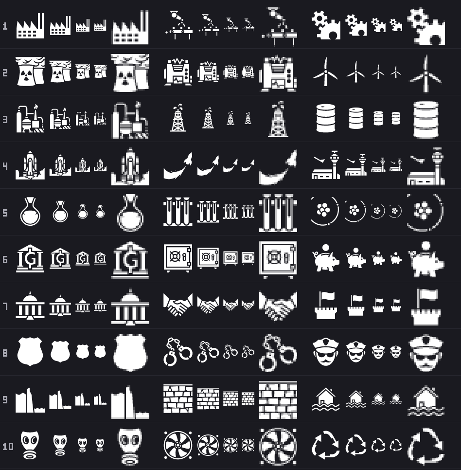
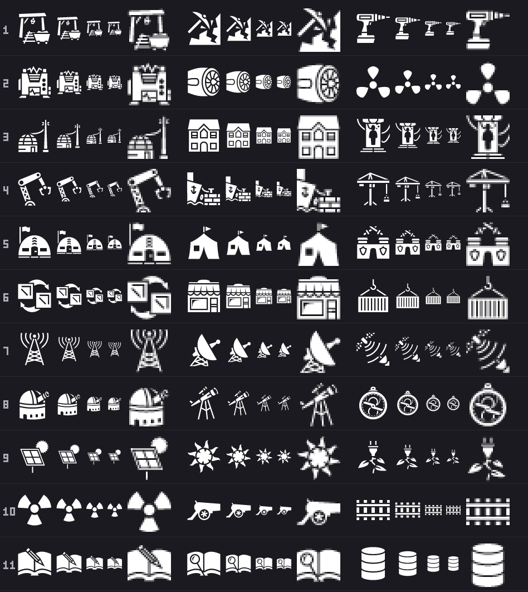

# Building art for the twenty-two kinds, legible in a slot box and on a Module tile

Research for ticket [#144](https://github.com/whaleyjoshua2/Dying-Earth/issues/144), version 0.07.3.
It follows the pattern of the flag research on [#123](https://github.com/whaleyjoshua2/Dying-Earth/issues/123)
(`docs/research/flag-art.md` on `research/flag-art`): a licensed source, candidates measured at the
sizes used, and a sheet for the designer to choose from. **Nothing is decided here**: which candidate
each kind wears, and whether it carries a fill, are the two drawing tickets'
([#145](https://github.com/whaleyjoshua2/Dying-Earth/issues/145),
[#146](https://github.com/whaleyjoshua2/Dying-Earth/issues/146)).

What the game needs: a picture for each of the ten Facilities (Factory, Power Plant, Refinery,
Launch Site, Research Lab, Bank, Embassy, Constabulary, Sea Wall, Scrubber) and the twelve Modules
(Mine, Generator, Refinery, Habitat, Shipyard, Barracks, Trade Post, Relay, Observatory, Solar
Array, Mass Driver, the Archive), drawn in a slot box on a 350-pixel card at about **28 to 32
pixels** and on a Module tile at **48 to 64**.

## Source and licence

**game-icons.net, CC BY 3.0.** The game already loads thirteen of its icons through `src/icons.rs`
and names each icon and author on the Credits screen, so every candidate below is a drop-in for the
present loader and the present credit. Read first-hand for this ticket:

- The site's [About page](https://game-icons.net/about.html): the icons "are provided under the
  terms of the Creative Commons 3.0 BY license", and "you can use them freely as long as you credit
  the original author in your creation. A mention like 'Icons made by {author}. Available on
  https://game-icons.net' is fine."
- The repository's [`license.txt`](https://github.com/game-icons/icons/blob/master/license.txt):
  "Icons provided under the Creative Commons 3.0 BY or CC0 if mentioned below", with one
  contributor (Viscious Speed) marked CC0. None of the candidates below is that contributor's.
- **Each of the sixty-two candidate pages was fetched** (`https://game-icons.net/1x1/<author>/<name>.html`,
  all HTTP 200 on 2026-09-12) and the name, the `rel="author"` link text and the `rel="license"`
  text read off it; every one says **CC BY 3.0**. The SVGs were fetched unmodified from the
  `game-icons/icons` repository (`<author>/<name>.svg`), as the thirteen in use were, into
  [`assets/icons/candidates/`](../../assets/icons/candidates). Every one opens with the same
  full-canvas black rectangle the loader strips, so all render through `Icons::load` as they are.

**What the Credits screen would have to add.** The present `CREDITS` names Delapouite, Lorc, Sbed and
Lord Berandas. The candidates would bring in **Skoll** (Oil drum, Solar power), **Caro Asercion**
(Astrolabe) and **Andy Meneely** (Police badge) if any of theirs is chosen; the rest are Delapouite's,
Lorc's and sbed's. The site titles its icons in sentence case ("Archive register"); the game's
Credits title-case them ("Mine Wagon"), which is a spelling and not a change of credit.

**One alternative source, for the gaps: [Tabler Icons](https://github.com/tabler/tabler-icons),
MIT** (copyright 2020-2026 Paweł Kuna, read from its `LICENSE`). 5,130 outline icons on a 24-pixel
grid with a filled set beside them, so nothing is required on screen and a notice ships with the
files, as with flag-icons. Its tree (fetched 2026-09-12) has `building-factory`, `solar-panel`,
`satellite`, `radar`, `building-bank`, `wall`, `rocket`, `building-fortress`, `building-wind-turbine`,
`air-conditioning`, `recycle`, `hammer-drill`, `tent`, `container`, `antenna`, `telescope`, `archive`,
`database`, `crane` and `air-traffic-control`. Two cautions: it is a **stroked** style (2-pixel lines
on a 24 grid) beside game-icons' filled silhouettes, so a Tabler building next to a game-icons
jerrycan would look like a different set, and its strokes thin at 28 the way `wind-turbine` does
below; and **it has the same gaps** -- no mass driver, no dam or sea wall, no embassy, no police, no
barracks, no cannon, no mine. Material Design Icons (Apache 2.0) is the other large set; only its
licence was read for this ticket, not its coverage.

## The candidates

Two or three per kind, from grepping the whole `game-icons/icons` tree (4,239 SVGs) for each kind's
words and its neighbours. The **#** is the row on the sheets. A name in `code` is the file stem, the
site's name for the icon follows in quotes with its author; "same" means the same file as a row
above. The last column is what the 28-pixel cell shows, read off the sheet and not assumed.

### Facilities (`sheet-facilities-*`)

| # | Kind | candidates (`file` "Site name", author) | at 28 pixels |
|---|---|---|---|
| 1 | Factory | `factory` "Factory", Delapouite; `factory-arm` "Factory arm", Delapouite; `gears` "Gears", Lorc | **factory survives**: sawtooth roof and two chimneys. factory-arm dissolves: the arm is a one-pixel line, leaving a conveyor and a smudge. gears survives but says "mechanism", not a building. |
| 2 | Power Plant | `nuclear-plant` "Nuclear plant", Delapouite; `power-generator` "Power generator", Delapouite; `wind-turbine` "Wind turbine", Delapouite | **nuclear-plant survives**: two cooling towers with steam; the trefoil is a dot but the towers carry it. power-generator is a lumpy box with a crest, a machine but not nameable. wind-turbine dissolves: the blades are one pixel wide, a faint Y on a stick. |
| 3 | Refinery | `refinery` "Refinery", Delapouite; `oil-rig` "Oil rig", Delapouite; `oil-drum` "Oil drum", Skoll | **refinery survives** as an industrial silhouette (tank, column, flare; the flare a speck). **oil-rig survives**: derrick triangle and a gusher blob. oil-drum survives cleanly but is a barrel, the Fuel jerrycan's family of thing. |
| 4 | Launch Site | `space-shuttle` "Space shuttle", Delapouite; `rocket-flight` "Rocket flight", Lorc; `control-tower` "Control tower", Delapouite | **space-shuttle survives** as a rocket on a pad, and at 28 it *is* a rocket: the Colony Ship's Rocket is the same family (see the worn sheet). rocket-flight reads as an arrow or swoosh at every size. control-tower dissolves: tower a stick, the aircraft specks. |
| 5 | Research Lab | `round-bottom-flask` "Round bottom flask", Lorc; `test-tubes` "Test tubes", Lorc; `atom-core` "Atom core", Delapouite | **round-bottom-flask survives** cleanly. **test-tubes survives** as a rack of three bars. atom-core survives as a broken ring round a cluster; readable, but not obviously an atom. |
| 6 | Bank | `bank` "Bank", Delapouite; `strongbox` "Strongbox", Delapouite; `piggy-bank` "Piggy bank", Delapouite | **bank survives** as a columned building, its letter a blob; the silhouette is the Capitol's (row 7). **strongbox survives**: square with a dial. **piggy-bank survives**, unmistakable. |
| 7 | Embassy | `capitol` "Capitol", Lorc; `shaking-hands` "Shaking hands", Delapouite; `tower-flag` "Tower flag", Delapouite | **capitol survives**: dome and columns, and collides with bank. **shaking-hands survives** as a handshake. **tower-flag survives**: a wall with a flag, reading as a fort. The site has no embassy as such. |
| 8 | Constabulary | `police-badge` "Police badge", Andy Meneely; `handcuffs` "Handcuffs", Lorc; `police-officer-head` "Police officer head", Delapouite | police-badge survives, but it is a plain shield: the Army's shield is drawn in code in the same fill, so a shield in a slot box would read as an army. **handcuffs survive** as two rings and a link. **police-officer-head survives**: cap and moustache. |
| 9 | Sea Wall | `dam` "Dam", Delapouite; `stone-wall` "Stone wall", Delapouite; `flood` "Flood", Delapouite | dam is an angled slab with a bar at 28, a step or a cliff; ambiguous. **stone-wall survives**: the brick pattern reads, and says "wall" but not "sea". **flood survives**: a house in waves, which names the hazard rather than the defence. The site has no sea wall or breakwater. |
| 10 | Scrubber | `gas-mask` "Gas Mask", Lorc; `computer-fan` "Computer fan", Delapouite; `recycle` "Recycle", Lorc | **gas-mask survives**, unmistakable, and says "poison" more than "cleaning". **computer-fan survives**: a bladed disc in a square. **recycle survives**: the universal sign, which says recycling, not air. The site has no scrubber or filter. The Chimney is Emissions' and is not offered. |

### Modules (`sheet-modules-*`)

| # | Kind | candidates (`file` "Site name", author) | at 28 pixels |
|---|---|---|---|
| 1 | Mine | `gold-mine` "Gold mine", Delapouite; `mining` "Mining", Lorc; `drill` "Drill", Delapouite | gold-mine survives, but at 28 it is a cart under a gantry, and the cart is the Materials' Mine Wagon: the collision the ticket named. **mining survives**: a pick striking rock, no cart. **drill survives** as a power drill, a tool rather than a place. |
| 2 | Generator | `power-generator` same as Facilities 2; `turbine` "Turbine", Delapouite; `nuclear` "Nuclear", sbed | power-generator as above. **turbine survives**: a wheel in a housing, seen side-on. nuclear is three petals with no ring; at 28 a propeller, and it does not say nuclear. |
| 3 | Habitat | `base-dome` "Base dome", Delapouite; `family-house` "Family house", Delapouite; `cryo-chamber` "Cryo chamber", Delapouite | **base-dome survives**: a low dome with a mast, the same family as the Colony's Habitat Dome (a geodesic dome on a stalk), which a Colony's Module window would draw beside it. **family-house survives** cleanly. cryo-chamber survives as a figure in a frame; a person in a box, ambiguous. |
| 4 | Shipyard | `cargo-crane` "Cargo crane", Lorc; `harbor-dock` "Harbor dock", Delapouite; `crane` "Crane", Delapouite | **cargo-crane survives**: an arm on a lattice with a claw. harbor-dock is a ship beside a brick block at 28, busy; borderline. **crane survives** as a T with a hanging line; its thin members fade. The site has no shipyard or hangar. |
| 5 | Barracks | `barracks` "Barracks", Delapouite; `barracks-tent` "Barracks tent", Delapouite; `medieval-barracks` "Medieval barracks", Delapouite | **barracks survives**: a Nissen hut with a flag. **barracks-tent survives**: a tent with a flag. medieval-barracks survives as a keep with crossed weapons and reads as a castle. |
| 6 | Trade Post | `trade` "Trade", Lorc; `shop` "Shop", Delapouite; `cargo-crate` "Cargo crate", Delapouite | **trade survives**: two squares and two arrows. **shop survives**: an awning storefront. **cargo-crate survives**: a striped container on a hook. |
| 7 | Relay | `radio-tower` "Radio tower", Delapouite; `radar-dish` "Radar dish", Lorc; `satellite-communication` "Satellite communication", Delapouite | **radio-tower survives**: the lattice fills to a triangle, the arcs read. **radar-dish survives** cleanly. satellite-communication is a smudge with arcs at 28, and is the Station's Defense Satellite family. |
| 8 | Observatory | `observatory` "Observatory", Delapouite; `telescope` "Telescope", Delapouite; `astrolabe` "Astrolabe", Caro Asercion | **observatory survives**: a dome with a slit and the telescope poking out. **telescope survives**; the tripod thins. astrolabe is a circle with lines at 28, a compass or a clock. |
| 9 | Solar Array | `solar-power` "Solar power", Skoll; `sun` "Sun", Lorc; `green-power` "Green power", Delapouite | **solar-power survives**: a tilted grid and a sun. sun survives but says "sun" or "heat", which on this board is the climate, not a building. green-power at 28 is a plug with two leaves; the plug reads, the leaves smear. |
| 10 | Mass Driver | `mass-driver` "Mass driver", sbed; `cannon` "Cannon", Lorc; `railway` "Railway", Delapouite | mass-driver is drawn as a **radiation trefoil** at every size (checked alone, off the sheet); it is a candidate in name only. **cannon survives** as a cannon silhouette. **railway survives** as a track. Nothing on the site draws a rail launcher; either of the last two is a metaphor. |
| 11 | Archive | `archive-register` "Archive register", Delapouite; `archive-research` "Archive research", Delapouite; `database` "Database", Delapouite | **archive-register survives**: an open book with a pen. archive-research survives, but the magnifier merges with the page at 28. **database survives** cleanly: stacked cylinders. |

The Module **Refinery** is the twenty-second kind and has no row of its own: its candidates are
Facilities row 3 (see the sharing note below).

## What survives at 28 pixels

Read off `sheet-facilities-untinted` and `sheet-modules-untinted`, the 28-pixel cell and its
magnification:

- **Survive with their meaning intact:** factory, nuclear-plant, refinery, oil-rig, oil-drum,
  space-shuttle, round-bottom-flask, test-tubes, bank, strongbox, piggy-bank, capitol,
  shaking-hands, tower-flag, handcuffs, police-officer-head, stone-wall, flood, gas-mask,
  computer-fan, recycle, mining, drill, turbine, base-dome, family-house, cargo-crane, crane,
  barracks, barracks-tent, medieval-barracks, trade, shop, cargo-crate, radio-tower, radar-dish,
  observatory, telescope, solar-power, sun, cannon, railway, archive-register, database.
- **Survive as a shape but say the wrong thing or nothing:** gears (mechanism), atom-core,
  police-badge (a shield), dam (a step), gold-mine (a cart), nuclear (a propeller), cryo-chamber,
  astrolabe, green-power, archive-research (magnifier lost), mass-driver (radiation).
- **Dissolve:** factory-arm, wind-turbine, control-tower, rocket-flight (an arrow at any size),
  satellite-communication, harbor-dock (borderline), power-generator (borderline).

The pattern is the one the earlier icon work found: a filled silhouette with two or three big
features survives; anything drawn with one-pixel members (turbine blades, a crane's lattice, a
control tower's mast, a robot arm) loses them at 28, and what remains is whatever thick shape was
underneath. Every candidate survives at 48 and 64; the Module tile is not where the choice bites.

## Where two kinds may share a picture, and where they must not

- **A Region's Refinery and a Colony's Refinery may share** (Facilities row 3). They are the same
  word for the same thing, and the two windows that draw them are never open on one screen.
- **Power Plant and Generator** (Facilities 2, Modules 2) offer `power-generator` on both rows: a
  Facility and a Module that do the same job could share it, or take `nuclear-plant` and `turbine`
  to keep them apart. A design call, so both are on the sheets.
- **Mine and Factory must not share**, and neither must resemble the Materials figure: `gold-mine`
  is a mine cart at 28 and the Mine Wagon is a mine cart, so **gold-mine is the one Mine candidate
  that collides with the board as it stands**; `mining` and `drill` do not. `factory` shares nothing
  with any of the three.
- **Bank and Embassy** collide on `bank` and `capitol` (both columned buildings); if one takes a
  columned building, the other should not.
- **Against the glyphs already worn** (`sheet-worn-untinted`, the thirteen icons in
  `assets/icons/`): `space-shuttle` is the Rocket's family (Colony Ship), `base-dome` is the
  Habitat Dome's (Colony), `satellite-communication` is the Defense Satellite's (Station),
  `police-badge` is the Army's drawn shield, `oil-drum` is the Jerrycan's family of container,
  and no candidate is offered that is the Microscope (Research), the Chimney (Emissions), the
  Mine Wagon (Materials) or the Modern City (Region). A Facility's picture sits in a slot box on a
  Nation card whose title wears the Region glyph, and a Module's on a tile in a window for a
  station or Colony that wears its own, so these families are worth avoiding where a plain
  alternative survives.

## Tinted or not

Every sheet exists four times: **untinted** (the file's own white on the panel), **offwhite** (the
`kind` fill, 236/232/224, that every kind glyph wears), **tint1** (the Custodians' teal, 38/166/153,
from `factions.toml`) and **tint2** (the Prospectors' orange, 217/128/51). The tint is applied the
way `egui::Image::tint` applies it, a per-channel multiply.

- **Off-white and untinted are indistinguishable on the sheet**, as the numbers say they should be
  (the kind fill is seven per cent below white). If a building's picture is to be "untinted" in the
  sense the flags are, that is the same look as the kind fill on a white-on-black icon.
- **A Faction colour changes nothing about legibility**: every reading above holds in teal and in
  orange, since these are silhouettes and the tint is flat. What it changes is the meaning: the rule
  in `icons.rs` is that on this board a colour means *whose*, so a building tinted in its holder's
  colour says who holds it, and a building in the kind fill says only what it is. Which the slot
  box wants is ticket #145's question; the sheets show both so it can be looked at.

## The sheets

Filed in [`docs/dev-diary/2026-09-12-version-0.07.3/`](../dev-diary/2026-09-12-version-0.07.3/):

- [building-art-sheet-facilities-untinted.png](../dev-diary/2026-09-12-version-0.07.3/building-art-sheet-facilities-untinted.png),
  [-offwhite](../dev-diary/2026-09-12-version-0.07.3/building-art-sheet-facilities-offwhite.png),
  [-tint1](../dev-diary/2026-09-12-version-0.07.3/building-art-sheet-facilities-tint1.png),
  [-tint2](../dev-diary/2026-09-12-version-0.07.3/building-art-sheet-facilities-tint2.png)
- [building-art-sheet-modules-untinted.png](../dev-diary/2026-09-12-version-0.07.3/building-art-sheet-modules-untinted.png),
  [-offwhite](../dev-diary/2026-09-12-version-0.07.3/building-art-sheet-modules-offwhite.png),
  [-tint1](../dev-diary/2026-09-12-version-0.07.3/building-art-sheet-modules-tint1.png),
  [-tint2](../dev-diary/2026-09-12-version-0.07.3/building-art-sheet-modules-tint2.png)
- [building-art-sheet-worn-untinted.png](../dev-diary/2026-09-12-version-0.07.3/building-art-sheet-worn-untinted.png):
  the thirteen glyphs in use, alphabetical (colony, colony_ship, ducats; emissions, energy, fuel;
  influence, materials, population; region, research, station; warship), the control.

Each cell is one candidate at 64, 48, 32 and 28 pixels, drawn as the game draws an icon (backing
rectangle stripped, glyph over the panel colour), then the 28 blown up three times without
smoothing. The rows are numbered to match the tables. The game's present path renders at 64 and
lets egui shrink the texture, which the flag research measured as "a little softer" than a direct
render; the sheet renders each size directly, so a slot box drawn through the present loader would
be very slightly softer than the cell.

**How the pictures were made:** [building-art/buildsheet.rs](building-art/buildsheet.rs), against
the game's own `resvg 0.45` and `image 0.25`, fed by [building-art/manifest.txt](building-art/manifest.txt)
(the rows above, one per line). Copy it to `examples/building_sheet.rs` and run
`cargo run --release --example building_sheet -- docs/research/building-art/manifest.txt assets/icons/candidates assets/icons <out-dir> 236,232,224 38,166,153 217,128,51`.
It never starts the game.

## Sources

- [game-icons.net, About](https://game-icons.net/about.html) -- licence and the attribution wording.
- [game-icons/icons, license.txt](https://github.com/game-icons/icons/blob/master/license.txt) and
  [README](https://github.com/game-icons/icons/blob/master/README.md).
- The sixty-two icon pages, `https://game-icons.net/1x1/<author>/<name>.html`, for the names in
  the tables (for example [Factory](https://game-icons.net/1x1/delapouite/factory.html),
  [Police badge](https://game-icons.net/1x1/andymeneely/police-badge.html),
  [Mass driver](https://game-icons.net/1x1/sbed/mass-driver.html)); all fetched 2026-09-12.
- The `game-icons/icons` tree via the GitHub API, 2026-09-12: 4,239 SVGs.
- [Tabler Icons, LICENSE (MIT)](https://github.com/tabler/tabler-icons/blob/main/LICENSE) and its
  tree via the GitHub API, 2026-09-12: 5,130 files under `icons/outline/`.
- [Material Design Icons, LICENSE (Apache 2.0)](https://github.com/google/material-design-icons/blob/master/LICENSE).
- `src/icons.rs` (the loader, `fill`, `KINDS`, `CREDITS`), `assets/data/factions.toml` (the four
  Faction colours), `docs/research/flag-art.md` on `research/flag-art` (the model and the
  "softer" measurement).
