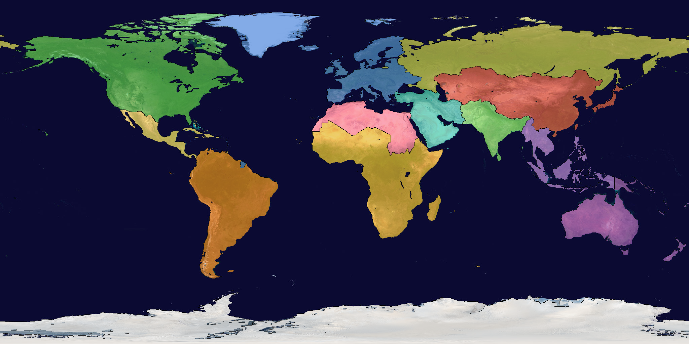

# Country boundary data for the Earth Map's region mask

Research for ticket [#124](https://github.com/whaleyjoshua2/Dying-Earth/issues/124), part of #120.
The designer's line: *"South Asia — now India — should be India, Pakistan, Bangladesh and Sri
Lanka"*: region borders are to follow real country borders as well as a 2048-wide globe allows,
and **two regions are to be added** (which two is undecided).

This note surfaces facts and recommends. It decides nothing: every design question below is put
as a choice with a recommendation attached. Nothing in the game was changed; the preview beside
this file was made by a throwaway Python script in the session scratchpad, not by
`prep_assets.rs`.

## What the game has now

- `assets/textures/earth_states.png`: 2048 by 1024, grey 8-bit, **0 = water, 1..13 = a region**,
  equirectangular, and it must match `earth.png` pixel for pixel (`src/textures.rs` refuses a
  mask of another size). Value 2 is Antarctica, which the window maps to no state (ticket #44).
- `examples/prep_assets.rs` makes it in two steps: **`is_water` reads the photograph** (`earth.png`,
  a pixel is water when blue exceeds red by 25 and blue is at least green), and for every land
  pixel `state_for(lon, lat)` picks a region from **lines of longitude and latitude**. The file's
  own words: *"a board, not an atlas."* 728,972 pixels are land by that rule.
- One pixel is 360/2048 = 0.176 degrees: about **19.6 km at the equator**, 14 km at 45 degrees
  north, 7 km at 70 degrees.

Whatever replaces the second step, the first step should stay: the coastline players see is the
photograph's, and any boundary set disagrees with it along every coast (measured below).

## The boundary data

### 1. Natural Earth, Admin 0 – Countries — public domain

- **Licence: public domain.** Terms of use, read first-hand: *"All versions of Natural Earth
  raster + vector map data found on this website are in the public domain. You may use the maps
  in any manner, including modifying the content and design, electronic dissemination, and
  offset printing."* And: *"No permission is needed to use Natural Earth. Crediting the authors
  is unnecessary."* A credit is offered as a courtesy: *"Made with Natural Earth."* The GitHub
  mirror's `LICENSE.md` says the same. No credits-screen consequence, unlike the icons (#102).
- **Version 5.1.1** (the `VERSION.txt` inside every zip; the download pages agree).
- **Boundaries are de facto**, *"according to who controls the territory, versus de jure"*.
  Crimea is therefore drawn in Russia, Kashmir is split along the lines of control, and Kosovo,
  Northern Cyprus, Somaliland, Western Sahara, Taiwan and Palestine are each their own feature.
  Most of these fall inside one region whichever way they go, so they cost the game nothing; the
  ones that do not are flagged in the table below.
- **Three scales, three files** (measured on the downloaded zips, 2026-09-12):

  | scale | zip | unzipped `.shp` + `.dbf` | GeoJSON (GitHub mirror) | features | polygons | ring points |
  |---|---|---|---|---|---|---|
  | 1:110m | 215 KB | 181 KB + 532 KB | 839 KB | 177 | 288 | 10,654 |
  | 1:50m | 800 KB | 1.6 MB + 787 KB | 3.1 MB | 242 | 1,616 | 99,613 |
  | 1:10m | 4.9 MB | 8.8 MB + 878 KB | (not fetched) | 258 | — | — |

  The web page's "258 countries" is the 10m count; the coarser files drop small features.
- **Formats.** The site ships **shapefile** (`.shp` geometry, `.dbf` attributes in dBase, `.prj`,
  `.shx`) and geodatabase; the GitHub mirror (`nvkelso/natural-earth-vector`) ships the same
  data as **GeoJSON**, which is plain JSON and needs no special reader.
- **Variants.** "Countries" is the one to use. "Map units" (817 KB at 50m) breaks France,
  Denmark, the Netherlands and so on into home country plus each overseas part; "sovereignty"
  merges the other way. "Countries without boundary lakes" cuts the Great Lakes and others out of
  the polygons, which does not matter here because the photograph decides water anyway.
- **Attributes** (168 per feature) include `ADM0_A3` (a stable three-letter code, the key to use),
  `ADMIN` and `NAME`, `SOVEREIGNT`, `TYPE` (sovereign country, dependency, disputed,
  indeterminate), `CONTINENT`, `SUBREGION` (the UN names: Western Asia, Southern Asia,
  Melanesia...), `REGION_WB` (the World Bank's seven regions), `POP_EST` (2019) and `GDP_MD`
  (millions of US dollars, mostly 2019). `SUBREGION` alone gets a country-to-region table most of
  the way; the exceptions are exactly the flagged cases below.

**Which scale for 2048 by 1024.** Both coarse files were rasterised at the mask's size and
compared (previews were inspected):

- The two are **indistinguishable on the continents** at this size; every difference is an
  island. No feature in either file vanishes entirely at 2048 by 1024.
- **1:110m omits 65 features** that 1:50m has, among them Hong Kong (7.5 million people),
  Singapore (5.7 m), Bahrain, Mauritius, Comoros, Macao, Cabo Verde, the Maldives, Malta,
  Barbados and every Pacific microstate. None of them changes a region's borders (each would
  join the region around it), but a land pixel with no polygon has to be filled from its
  neighbours, and 1:50m leaves 35 per cent fewer such pixels to fill.
- **1:50m has 30 features of four pixels or fewer** (Bahrain, Andorra, Liechtenstein, the
  Maldives, Monaco, the Vatican...). They are not worth drawing but cost nothing.
- 1:10m is five megabytes of coastline the mask cannot show; nothing gained.

**Recommendation: 1:50m**, the GeoJSON from the GitHub mirror (3.1 MB) or the zip (0.8 MB).
The trade-off is one megabyte against the 110m file for islands and city-states the map can
barely show; it buys fewer fill-ins and the Singapore-sized places being real polygons rather
than guesses. Either scale is fine; 110m would not be a mistake.

**Overseas parts hide inside single features.** In the "countries" file one `France` feature
holds French Guiana, Guadeloupe, Martinique, Réunion and Mayotte; `Netherlands` holds Bonaire,
Saba and Sint Eustatius; `Norway` holds Svalbard and Jan Mayen; `New Zealand` holds Tokelau;
`Chile` holds Easter Island; `South Africa` holds the Prince Edward Islands; `Australia` holds
Macquarie; `United States` holds Alaska and Hawaii. In the test raster French Guiana came out
Europe-blue in South America. The pipeline needs either the "map units" variant or a rule such
as "a polygon whose centre lies more than 25 degrees from its country's main body takes the
region of the land nearest it" (the old *islands go with the nearest continent* rule, applied
only to these parts). That is a technical fix; which region Réunion or Hawaii joins is a
design call and is in the table.

### 2. geoBoundaries — CC BY 4.0, attribution required

- **Licence: CC BY 4.0** (the site; the GitHub README says "CC BY 4.0 / ODbL" and *"the only
  requirement for use is acknowledgement"*). The site is specific about the acknowledgement:
  for *"other products (apps, films)"* display **"geoBoundaries"** prominently, with the full URL
  if it cannot be a link. Like game-icons.net, that means a credits screen.
- Products: high-precision single-country files (each country's own view of its borders, so
  disputed areas overlap), simplified single-country files, and **CGAZ**, a global composite at
  ADM0/1/2 *"clipped to international boundaries (US Department of State), with gaps filled"*.
  CGAZ ADM0 is the comparable file. It is far finer than 20 km per pixel needs.
- Verdict: usable, but it costs a credit that Natural Earth does not, for detail the mask cannot
  show. Worth knowing about if the game ever wants provinces (ADM1) inside a region.

### 3. GADM — not usable

- **Licence, quoted:** *"The data are freely available for academic use and other non-commercial
  use. Redistribution or commercial use is not allowed without prior permission."* A game that
  ships the mask derived from it would be redistributing a derivative. Ruled out.

### The comparison

| | licence | credit needed | formats | fit for 20 km/px |
|---|---|---|---|---|
| Natural Earth 1:50m | public domain | no | shapefile, GeoJSON | right size |
| Natural Earth 1:110m | public domain | no | shapefile, GeoJSON | slightly coarse; drops 65 small places |
| geoBoundaries CGAZ | CC BY 4.0 | **yes, visible** | GeoJSON, shapefile, topojson | far finer than needed |
| GADM | non-commercial, no redistribution | — | — | ruled out |

## Rasterising it into the existing mask

### Crates

Nothing new is required. What is in the tree, and what could be added:

| crate | in the tree? | licence | pure Rust | size | note |
|---|---|---|---|---|---|
| `image` 0.25 | yes, direct | MIT OR Apache-2.0 | yes | — | already writes the mask and reads `earth.png` |
| `serde_json` 1.0.151 | in `Cargo.lock` (via `gltf` under Bevy), **not declared** | MIT OR Apache-2.0 | yes | — | one `[dev-dependencies]` line makes it usable from an example; no new download. Parses the GeoJSON as `serde_json::Value`, which is all this job needs |
| `geojson` 1.0.0 | no | MIT/Apache-2.0 | yes (serde, serde_json, thiserror, tinyvec, log; optional `geo-types`) | 189 KB | typed `FeatureCollection`, `Geometry`, `feature.property("ADM0_A3")`; a convenience over raw `serde_json`, not a necessity |
| `shapefile` 0.9.0 + `dbase` 0.8.0 | no | MIT | yes (byteorder, dbase) | 50 KB + 81 KB | reads the `.shp`/`.dbf` pair directly, `Reader::from_path` yielding shape and record together; only needed if the zip is preferred to the GeoJSON |
| `geo` 0.33.1 | no | MIT OR Apache-2.0 | yes | 420 KB | point-in-polygon and areas; overkill, and per-pixel `contains` over two million pixels and 1,616 polygons is the slow way round |
| `geo-rasterize` 0.1.2 | no | MIT OR Apache-2.0 | yes | 25 KB | does exactly this job, but its last release is January 2022 and it pins `geo ^0.18` and `ndarray ^0.15`, so it would drag an old second `geo` into the lock. Not recommended |

**Recommendation: no new crate.** `serde_json` (already resolved in the lock) plus a forty-line
scanline fill inside `prep_assets.rs`. The trade-off is writing the fill by hand rather than
calling a library; a scanline even-odd fill on a 2048-wide grid is short and, being in the
example, is testable by counting pixels. If a typed reader is wanted anyway, `geojson` is the
one to add (small, pure Rust, permissive); `shapefile` only if the designer prefers to keep the
official zip rather than the GitHub GeoJSON.

### The pipeline

1. **Source file.** Fetch `ne_50m_admin_0_countries.geojson` (or the zip) into the same
   source directory the example already takes for the NASA JPEGs. The licence permits committing
   it, but 3 MB of coastline in the repo buys nothing: the mask is the artefact, and the header
   can name the URL and version (5.1.1) the way it names the JPEGs. Technical choice, either way
   is fine.
2. **Country to region table**, keyed by `ADM0_A3`, as data (a `[[country]]` list in
   `nation_states.toml` or a file beside it), so the designer edits assignments without touching
   Rust. The table below is the draft.
3. **Project every ring** to pixel space with the mask's own mapping,
   `x = (lon + 180) / 360 * 2048`, `y = (90 - lat) / 180 * 1024`, the inverse of what
   `state_for` and `geo::pixel_for` do now. Natural Earth already splits polygons at the
   antimeridian (Russia's Chukotka and Fiji have parts at exactly +180 and -180), so no ring
   crosses the seam.
4. **Fill polygons into a "country layer"**, a second 2048 by 1024 grid holding a feature index.
   Draw features largest-first so enclaves (Lesotho inside South Africa, San Marino and the
   Vatican inside Italy, the Gambia inside Senegal) overwrite what surrounds them; even-odd
   scanline fill handles a feature's own holes when its rings are filled in one pass. Any land
   too thin for a pixel (the Gambia is one to two pixels wide) is simply overwritten by its
   neighbour; that is the resolution, not a bug.
5. **Combine with the photograph.** For each pixel: `is_water(earth.png)` → 0 as now;
   else if the country layer is set → that country's region; else **nearest-region fill** (an
   8-neighbour flood from the assigned land, wrapping in x). Measured at 1:50m between 60 S and
   75 N: 10,725 photograph-land pixels have no polygon under them, **2 rings of fill cover 90 per
   cent and 4 rings cover 99 per cent**; the rest are shallow seas the photograph paints as land
   (the north Caspian, the Bahama banks) which the fill reaches in a few more rings. Cap the fill
   (say 12 rings) and let anything beyond it fall to water. This keeps today's rule that an atoll
   the photograph shows goes with the nearest land.
6. **Lakes.** Natural Earth's "countries" polygons cover the Great Lakes, Victoria, Baikal and
   Ladoga; the photograph shows them blue, so they stay water as they are today. That is the
   13,813 pixels of "Natural Earth land, photograph water" in the measurement, and it is the
   right outcome.
7. **Antarctica** stays value 2: paint the `ATA` feature to 2 and anything south of 60 degrees
   with no polygon (the sea ice the photograph shows white) to 2 as well; the window already
   maps 2 to no state. Arctic sea ice north of 75 degrees is the one place the fill reaches far;
   painting it water above, say, 82 degrees north is a one-line rule and changes nothing a
   player sees.
8. **Checks worth building into the example** (red before green): every country in the table
   with more than a million people has at least one pixel; every region has pixels; the pixel
   counts and preview `prep_assets.rs` already prints stay, so a designer can see the result
   before it is committed.
9. **Runtime is untouched.** `textures.rs` reads the same PNG. Two new regions mean values 14
   and 15 appended to `MASK_STATES` exactly as #53 appended 10 to 13, two `StateId` variants,
   two `state_lonlat` anchors and two toml rows with neighbours: the map ticket's scope, listed
   only so nothing is missed.

### What it does to the map, measured

Against the current mask, with the draft table below (Greenland put with Europe in the test to
show the effect), **7.0 per cent of land pixels change region**. The biggest movements:

| from | to | pixels | what it is |
|---|---|---|---|
| North America | Europe | 21,889 | Greenland (test assignment; see flags) |
| Russia | East Asia | 6,816 | northern Kazakhstan, which the latitude line gave to Russia |
| North Africa | Sub-Saharan Africa | 6,079 | Mali, Niger and Chad north of 18 N, Mauritania |
| Sub-Saharan Africa | North Africa | 3,269 | southern Sudan (the country), which the line cut |
| East Asia | Russia | 1,767 | Siberian border pixels the lines placed wrongly |
| Middle East | East Asia | 1,727 | Turkmenistan's corner |
| East Asia | South Asia | 1,596 | Kashmir and the Himalayan line |

Region sizes barely move except where a flagged case moves a whole country: Europe +73 per cent
is Greenland; without it Europe is unchanged, and North America shrinks by nothing.

## Country-to-region table for the current twelve

Drawn from the toml's own comments and `prep_assets.rs`'s header first, Natural Earth's
`SUBREGION` second. Codes are Natural Earth `ADM0_A3`. **Flagged** means the designer has a real
choice; the recommendation is beside it. Every other row simply follows the toml.

| region (mask value) | countries | flagged |
|---|---|---|
| Sub-Saharan Africa (1) | Angola, Benin, Botswana, Burkina Faso, Burundi, Cabo Verde, Cameroon, Central African Rep., Chad, Comoros, DR Congo, Congo, Côte d'Ivoire, Djibouti, Equatorial Guinea, Eritrea, Eswatini, Ethiopia, Gabon, Gambia, Ghana, Guinea, Guinea-Bissau, Kenya, Lesotho, Liberia, Madagascar, Malawi, Mali, Mauritania, Mauritius, Mozambique, Namibia, Niger, Nigeria, Rwanda, São Tomé, Senegal, Seychelles, Sierra Leone, Somalia, Somaliland (SOL), South Africa, South Sudan (SDS), Tanzania, Togo, Uganda, Zambia, Zimbabwe | Mali, Niger and Chad reach to 23 N: whole countries move the Sahara line south of where the toml drew it (6,079 px). Réunion and Mayotte (French) |
| North Africa (10) | Morocco, Algeria, Tunisia, Libya, **Egypt**, Sudan, Western Sahara (SAH) | Egypt; Western Sahara (de facto Moroccan, own feature; either way North Africa) |
| The Middle East (9) | **Turkey**, Cyprus, Northern Cyprus (CYN), Syria, Lebanon, Israel, Palestine (PSX), Jordan, Iraq, **Iran**, Saudi Arabia, Yemen, Oman, UAE, Qatar, Bahrain, Kuwait, **Armenia, Azerbaijan, Georgia** | Turkey, Iran, the Caucasus, Cyprus |
| Europe (5) | Albania, Andorra, Austria, Belarus, Belgium, Bosnia, Bulgaria, Croatia, Czechia, Denmark, Estonia, Finland, France, Germany, Greece, Hungary, Iceland, Ireland, Italy, Kosovo (KOS), Latvia, Liechtenstein, Lithuania, Luxembourg, Malta, Moldova, Monaco, Montenegro, Netherlands, North Macedonia, Norway, Poland, Portugal, Romania, San Marino, Serbia, Slovakia, Slovenia, Spain, Sweden, Switzerland, Ukraine, United Kingdom, Vatican, Faroes, Isle of Man, Jersey, Guernsey, Åland, Gibraltar | Ukraine and Belarus (toml: Europe; the current lines already put them there). Crimea is drawn in Russia's feature. The Canaries (Spain, off Africa) and Madeira/Azores |
| Russia (8) | Russia (one feature; includes Kaliningrad, Crimea de facto, Kuril Islands) | **Kazakhstan** — see below. Kaliningrad becomes a few Russian pixels inside Europe |
| East Asia (3) | China, Hong Kong, Macao, Taiwan, Mongolia, Japan, South Korea, North Korea, **Kazakhstan**, Uzbekistan, Turkmenistan, Kyrgyzstan, Tajikistan | Kazakhstan; Taiwan (own feature; East Asia either way); Aksai Chin is in China's feature |
| South Asia (11) | India, Pakistan, Bangladesh, Sri Lanka, Nepal, Bhutan, Maldives, Afghanistan, Siachen (KAS) | Afghanistan (toml: South Asia; alternatives Middle East or with Central Asia). Kashmir: both lines of control are South Asia, so the dispute costs nothing |
| South-East Asia (12) | Myanmar, Thailand, Laos, Cambodia, Vietnam, Malaysia, Singapore, Brunei, **Indonesia**, Timor-Leste, Philippines | Indonesia's half of New Guinea |
| Australia and Oceania (4) | Australia, New Zealand, Papua New Guinea, Fiji, Solomons, Vanuatu, Samoa, Tonga, Kiribati, Micronesia, Marshalls, Palau, Nauru, Tuvalu, New Caledonia, French Polynesia, Guam, N. Marianas, American Samoa, Norfolk, Pitcairn, Niue, Cook Islands, Wallis and Futuna, Heard Island | Hawaii is in the United States feature (North America), though it sits in Polynesia where the current lines give it to Oceania |
| North America (6) | United States (with Alaska and Hawaii), Canada, Bermuda, St Pierre and Miquelon, **Greenland** | Greenland; Hawaii |
| Central America and the Caribbean (13) | **Mexico**, Guatemala, Belize, Honduras, El Salvador, Nicaragua, Costa Rica, Panama, Cuba, Haiti, Dominican Rep., Jamaica, Puerto Rico, Bahamas, Trinidad, Barbados, St Lucia, St Vincent, Grenada, Antigua, Dominica, St Kitts, Aruba, Curaçao, Sint Maarten, Caymans, Turks and Caicos, British and US Virgin Islands, Anguilla, Montserrat, St Barthélemy, St Martin | Mexico; the French and Dutch islands are inside the France/Netherlands features |
| South America (7) | Brazil, Argentina, Colombia, Venezuela, Peru, Chile, Ecuador, Bolivia, Paraguay, Uruguay, Guyana, Suriname, Falklands (FLK), South Georgia (SGS) | French Guiana is inside the France feature; the Falklands are a UK feature marked Disputed |
| none (2) | Antarctica (ATA), French Southern Lands (ATF), Bouvet, and the sea ice | — |

Two 1:50m features are not in the table: Ashmore and Cartier Islands (ATC) and the Indian Ocean
Territories (IOA), Australian specks of a pixel each; Australia is the natural home.

**The check that the table matches the toml.** World Bank 2023 figures summed over these lists
(Taiwan from Natural Earth's own attributes, since the World Bank has no row for it) reproduce
the toml's numbers, which says the toml was drawn from the same kind of source and the borders
can follow countries without re-deriving anything:

| region | toml population (1e8) | World Bank 2023 (1e8) | toml gdp (tenths of world) | World Bank 2023 share |
|---|---|---|---|---|
| Sub-Saharan Africa | 11.4 | 12.1 | 2 | 1.9 % |
| North Africa | 2.6 | 2.7 | 1 | 0.9 % |
| East Asia | 16.4 | 17.1 (with Taiwan 17.3) | 23 | 23.6 % |
| South Asia | 19.4 | 19.5 | 4 | 4.1 % |
| South-East Asia | 6.8 | 6.9 | 3 | 3.6 % |
| Australia and Oceania | 0.5 | 0.5 | 2 | 1.9 % |
| Europe | 6.0 | 6.0 | 20 | 22.3 % |
| North America | 3.8 | 3.8 | 23 | 28.0 % |
| Central America and the Caribbean | 2.2 | 2.2 | 2 | 2.3 % |
| South America | 4.5 | 4.3 | 5 | 3.9 % |
| Russia | 1.5 | 1.4 | 3 | 1.9 % |
| The Middle East | 3.5 | 3.9 | 5 | 4.6 % |

(World total 8,063 million people and 107.3 trillion dollars; the table covers 99.7 per cent of
people and 99.1 per cent of output. The Middle East's extra 0.4 is the Caucasus and Cyprus,
which the toml's comment names but its population figure may not have counted.)

### The flagged cases, one by one

- **Turkey (85 m people, 1.14 tn).** The toml's own definition of the Middle East begins "Turkey
  to Iran", and the current lines put it there. The alternative is Europe (NATO, a candidate for
  the EU, Istanbul on the European shore). Natural Earth draws Turkey as one feature, so a
  country border puts it whole on one side; keeping Thrace with Europe would mean keeping one
  line of longitude at the Bosporus. *Recommendation: the Middle East, as the toml says.*
- **Egypt (115 m, 0.40 tn).** The toml's North Africa is "Morocco to Egypt and down through
  Sudan", and the current lines agree; the whole country brings the Sinai with it, which the
  latitude line gave to the Middle East (a few hundred pixels). Alternative: the Middle East,
  where the World Bank and Natural Earth's `REGION_WB` file it. *Recommendation: North Africa,
  as the toml says.*
- **Iran (91 m, 0.46 tn).** The toml names it in the Middle East. Alternatives: South Asia
  (it borders Pakistan and Afghanistan) or a new region with Turkey and the Caucasus (see
  candidates). *Recommendation: the Middle East, as the toml says.*
- **The Caucasus (Armenia 3 m, Azerbaijan 10 m, Georgia 4 m).** The header of `prep_assets.rs`
  names them in the Middle East, and the latitude line at 44 N does that today. Alternatives:
  Europe (Georgia and Armenia are in the Council of Europe) or Russia (the old empire). Seventeen
  million people, so no figure moves. *Recommendation: the Middle East, as now; if Turkey moves to
  Europe, move Georgia and Armenia with it.*
- **Kazakhstan (20 m, 0.26 tn).** The one place the current mask splits a country: the header
  says Russia "with northern Kazakhstan", and the line at 50 N does it. Country borders end that.
  Options: whole to East Asia with the other four Central Asian states (the toml's East Asia
  comment already says "Central Asia"), whole to Russia, or keep the latitude cut as an
  exception. Whole to East Asia moves 6,816 pixels (4 per cent of Russia's area) and no people
  the toml counts. *Recommendation: whole to East Asia; a single exception to "borders are
  countries" is worse than four per cent of Russia's steppe.*
- **Mexico (130 m, 1.79 tn).** The toml's Central America is "Mexico down to Panama and the
  islands", and Mexico is 58 per cent of that region's people and 71 per cent of its output.
  The alternative is North America, where the World Bank, Natural Earth's `CONTINENT`, and the
  trade bloc put it; Central America would then be 95 million people and 0.7 per cent of world
  output, the poorest state on the map. *Recommendation: Central America, as the toml says; note
  that if a candidate split were "Mexico out of Central America" the remainder cannot carry an
  Influence of 1 and leave Mexico any.*
- **Indonesia and the Pacific.** Today the line at 128 E hands Indonesia's half of New Guinea
  (and the Moluccas) to Australia and Oceania; the toml says "most of Indonesia". Country borders
  put all of Indonesia (281 m) in South-East Asia, with a straight border across New Guinea at
  141 E, visible on the preview. Papua New Guinea, the Solomons, Fiji, Vanuatu and every
  Pacific state stay with Australia and Oceania (the `Melanesia`, `Micronesia`, `Polynesia`
  subregions). Timor-Leste is `South-Eastern Asia`. Alternative: keep the island of New Guinea
  whole with Oceania by treating Indonesia's Papua provinces as the second country split, which
  needs a longitude line. *Recommendation: whole Indonesia to South-East Asia; the 141 E border
  is a real one.*
- **Greenland (56,000 people, 3 bn).** A separate Natural Earth feature under Danish
  sovereignty, `CONTINENT = North America`. Today it is North America (everything west of 30 W).
  Options: North America (as now), Europe (Denmark), or **none** like Antarctica (it is an ice
  sheet; 21,889 pixels, more than the whole Middle East's 19,415, so its colour dominates the
  top of the map for a region that gains nothing from it). *Recommendation: North America as
  now, or none; not Europe, which would paint a tenth of the visible land in Europe's colour for
  fifty-six thousand people.*
- **Islands.** With country borders the rule becomes *an island belongs to its country*, and
  "nearest continent" applies only to the far-flung parts of a single feature. Consequences
  worth a glance: Hawaii → North America (United States) where the lines give it to Oceania;
  the Canaries → Europe (Spain); Réunion and Mayotte → Europe (France) unless the far-part rule
  gives them Sub-Saharan Africa; the Falklands → South America (a UK feature, marked Disputed,
  `CONTINENT = South America`); Cyprus → the Middle East by `SUBREGION` (Western Asia) though it
  is in the EU; Malta → Europe; Sri Lanka and the Maldives → South Asia; Madagascar, Mauritius,
  the Seychelles, the Comoros → Sub-Saharan Africa; Puerto Rico and every Caribbean island →
  Central America and the Caribbean; New Zealand → Australia and Oceania; Japan and Taiwan →
  East Asia; Iceland, the Faroes, Svalbard → Europe; Bermuda → North America. Atolls the
  photograph shows but Natural Earth omits take the nearest region by the fill, as today.

## Candidates for the two new regions

Population in the toml's unit (hundreds of millions) and share of world output, World Bank
2023, for the piece cut out and for what remains of its parent. The toml's rule since #53 is
that *a split shares out its parent's figure exactly*; Influence was set from GDP and military
shares and this note only has the GDP half, so the Influence column is the parent's figure
divided by GDP share and rounded, an indication and not the number.

| candidate | cut out: people / output | left behind: people / output | Influence today → split | what it does |
|---|---|---|---|---|
| **Japan and Korea** out of East Asia | 2.0 / 5.8 % | 15.0 / 17.8 % | 4 → 1 + 3 (gdp 23 → 6 + 17) | A second rich Pacific power; East Asia becomes China, Mongolia and Central Asia. Both halves stay strong |
| **Brazil** out of South America | 2.1 / 2.0 % | 2.2 / 1.9 % | 2 → 1 + 1 (gdp 5 → 2 + 3) | The most even split on the map, mirroring how Central America was cut from North America |
| **Andean states** (Colombia, Venezuela, Ecuador, Peru, Bolivia, Chile) out of South America | 1.6 / 1.2 % | 2.7 / 2.8 % | 2 → 1 + 1 (gdp 5 → 2 + 3) | The geography the ticket named; Brazil, Argentina and the south remain |
| **Arabian Peninsula** out of the Middle East | 1.0 / 2.1 % | 3.0 / 2.5 % | 4 → 2 + 2 (gdp 5 → 2 + 3) | Puts the oil in one state and Turkey, the Levant, Iraq and Iran in the other; both halves keep Influence |
| **Turkey, the Caucasus and Iran** out of the Middle East | 1.9 / 1.6 % | 2.0 / 2.9 % | 4 → 2 + 2 (gdp 5 → 2 + 3) | The non-Arab Middle East against the Arab one; settles the Turkey and Iran flags by making them a state |
| **Eastern Europe** (former bloc and Balkans, Ukraine, Belarus) out of Europe | 1.7 / 2.5 % | 4.3 / 19.8 % | 5 → 1 + 4 (gdp 20 → 2 + 18) | A poorer, contested east between Europe and Russia; the west stays Europe |
| **Britain and Ireland** out of Europe | 0.7 / 3.7 % | 5.2 / 18.6 % | 5 → 1 + 4 (gdp 20 → 4 + 16) | Small in people; an island state with Influence |
| **Scandinavia** (Nordics) out of Europe | 0.3 / 1.7 % | 5.7 / 20.6 % | 5 → 0 + 5 | Too small to carry a figure without inventing one |
| **Iberia** out of Europe | 0.6 / 1.8 % | 5.4 / 20.5 % | 5 → 0 + 5 | Likewise |
| **Central Asia** (the five stans) out of East Asia | 0.8 / 0.4 % | 16.3 / 23.2 % | 4 → 0 + 4 | Fixes the Kazakhstan question by making it a state, but it would start with no Influence and gdp 0 |
| **Maritime South-East Asia** (Indonesia, Philippines, Malaysia, Brunei, Singapore, Timor) out of SE Asia | 4.4 / 2.5 % | 2.5 / 1.0 % | 1 → 1 + 0 | The mainland would have no Influence; the islands would |
| **Mexico** out of Central America | 1.3 / 1.7 % | 1.0 / 0.7 % | 1 → 1 + 0 | The remainder becomes the poorest state on the map with no Influence |
| **West Africa** (ECOWAS and Mauritania) out of Sub-Saharan Africa | 4.4 / 0.8 % | 7.6 / 1.2 % | 1 → 0 + 1 (gdp 2 → 1 + 1) | Splits the largest lump by area and the second by people, but one half has no Influence unless a point is added |
| **East Africa and the Horn** out of Sub-Saharan Africa | 3.6 / 0.4 % | 8.5 / 1.6 % | 1 → 0 + 1 | Likewise |
| **India alone** (rest: Pakistan, Bangladesh, Sri Lanka, Nepal, Bhutan, Maldives, Afghanistan) | 14.4 / 3.3 % | 5.1 / 0.9 % | 2 → 2 + 0 | The designer's line ("India, Pakistan, Bangladesh and Sri Lanka") reads as keeping South Asia together, not this |
| **Canada** out of North America | 0.4 / 2.0 % | 3.4 / 25.9 % | 7 → 1 + 6 | Small in people; the United States alone would still be the richest state |
| **Pacific islands** out of Australia and Oceania | 0.1 / 0.1 % | 0.3 / 1.9 % | 2 → 0 + 2 | Too small |

### Recommendation, with its trade-off

**Japan and Korea out of East Asia, and Brazil out of South America.** They are the two cuts
where both halves keep an Influence of at least one and a gdp of at least one under the toml's
own rule of sharing the parent's figure without inventing more, so the Influence economy is
unchanged as it was through #53; both follow real borders that read at a glance on the globe;
and both give the map a new power rather than a new poor space. Japan and Korea also relieves
East Asia, which at gdp 23 is level with North America.

**The trade-off:** neither touches the two biggest lumps, Sub-Saharan Africa (1.2 billion
people, one Influence) and South Asia (1.95 billion, two). Any cut there leaves one half with no
Influence, so splitting them means adding Influence to the world, which #53 deliberately did
not do. If the designer would rather balance geography than economy, the pairing is **the
Arabian Peninsula out of the Middle East and West Africa out of Sub-Saharan Africa**: it also
settles the Turkey and Iran flags (they stay in a smaller Middle East) and gives Africa two
states of comparable size, at the price of one new Influence point for Sub-Saharan Africa's
remainder. The Andes in place of Brazil is the same economics with a different shape (the
remainder is Brazil plus the south rather than the Andes plus the south); the ticket named it
and it is a fair alternative.

## Sources

Read on 2026-09-12.

- [Natural Earth — Terms of Use](https://www.naturalearthdata.com/about/terms-of-use/) (public domain, no credit required)
- [Natural Earth — Admin 0 Countries, 1:110m](https://www.naturalearthdata.com/downloads/110m-cultural-vectors/) (v5.1.1; zip 210 KB)
- [Natural Earth — Admin 0 Countries, 1:50m](https://www.naturalearthdata.com/downloads/50m-cultural-vectors/) (v5.1.1; zip 782 KB)
- [Natural Earth — Features and scales](https://www.naturalearthdata.com/features/)
- [Natural Earth vector on GitHub — LICENSE.md](https://github.com/nvkelso/natural-earth-vector/blob/master/LICENSE.md) and the [GeoJSON folder](https://github.com/nvkelso/natural-earth-vector/tree/master/geojson) (`ne_50m_admin_0_countries.geojson`, 3.1 MB; `ne_110m_admin_0_countries.geojson`, 839 KB)
- Direct zips measured: `https://naciscdn.org/naturalearth/{110m,50m,10m}/cultural/ne_*_admin_0_countries.zip` and `_map_units.zip`
- [geoBoundaries](https://www.geoboundaries.org/) and its [GitHub README](https://github.com/wmgeolab/geoBoundaries) (CC BY 4.0; acknowledgement required)
- [GADM — Licence](https://gadm.org/license.html) (non-commercial; no redistribution)
- [crates.io — geojson 1.0.0](https://crates.io/crates/geojson), [shapefile 0.9.0](https://crates.io/crates/shapefile), [dbase 0.8.0](https://crates.io/crates/dbase), [geo 0.33.1](https://crates.io/crates/geo), [geo-rasterize 0.1.2](https://crates.io/crates/geo-rasterize) (licences and dependency lists from the crates.io API); [docs.rs — geojson](https://docs.rs/geojson/latest/geojson/); [shapefile-rs on GitHub](https://github.com/tmontaigu/shapefile-rs)
- World Bank Indicators API, 2023: [population `SP.POP.TOTL`](https://api.worldbank.org/v2/country/all/indicator/SP.POP.TOTL?date=2023&format=json&per_page=400) and [GDP `NY.GDP.MKTP.CD`](https://api.worldbank.org/v2/country/all/indicator/NY.GDP.MKTP.CD?date=2023&format=json&per_page=400); no rows for Taiwan, Eritrea, South Sudan, Syria, Yemen, Cuba and North Korea's GDP (Natural Earth's `POP_EST`/`GDP_MD` used for Taiwan: 23.6 m, 1,127 bn, 2020/2016)
- In the tree: `examples/prep_assets.rs`, `src/textures.rs`, `src/geo.rs`, `assets/data/nation_states.toml`, `Cargo.toml`, `Cargo.lock` (serde_json 1.0.151 resolved under `gltf`)
