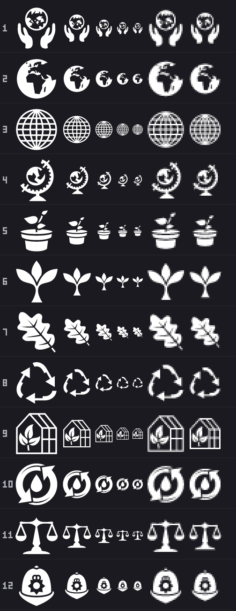
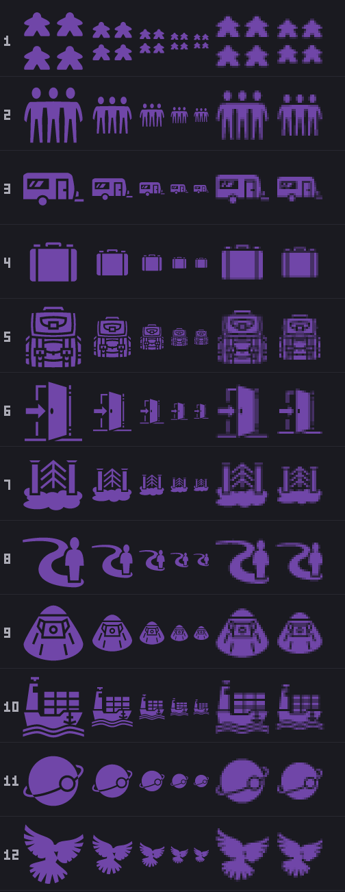

# Symbols for the four Factions: what exists, what it costs in credit, and what reads at card size

Research for ticket [#167](https://github.com/whaleyjoshua2/Dying-Earth/issues/167), version 0.07.5.
It follows the pattern of the building-art research on
[#144](https://github.com/whaleyjoshua2/Dying-Earth/issues/144) (`docs/research/building-art.md` on
`research/building-art`), which followed the flag research on
[#123](https://github.com/whaleyjoshua2/Dying-Earth/issues/123): licensed sources, candidates
measured at the sizes actually used, and sheets for the designer to choose from. **Nothing is chosen
here.** The choosing is [#168](https://github.com/whaleyjoshua2/Dying-Earth/issues/168), which this
ticket blocks.

What the designer asked for: *"I want to pick four symbols to represent the factions - for now these
symbols should only appear on the faction selection screen in their respective cards."*

| Faction | Colour (`factions.toml`) | Blurb | Signature |
|---|---|---|---|
| **Custodians** | teal, `[0.15, 0.65, 0.6]` = 38, 165, 153 | *Colonize the solar system while limiting ecological damage to Earth.* | the Scrubber, Leapfrog, Production Moved |
| **Prospectors** | orange, `[0.85, 0.5, 0.2]` = 216, 127, 51 | *Maximize extraction regardless of ecological cost.* | Cheap Industry, the Strip Permit, the Venture Capital Fund |
| **Arkwrights** | violet, `[0.44, 0.275, 0.66]` = 112, 70, 168 | *Leave Earth: the diaspora is the point.* | Steerage |
| **Archivists** | crimson, `[0.871, 0.322, 0.439]` = 222, 82, 111 | *Build the Archive and upload everyone.* | Provisional Findings |

## The size the question is really about

`faction_card` in `src/ui.rs` draws the title row as a **24-by-24 rounded colour swatch** beside the
Faction's name at **24 points**, both in the Faction's colour. So a symbol that sits in that row is
28 to 40 pixels if it stands beside the swatch, and **exactly 24** if it takes the swatch's place.
That is one notch below the 28 the ticket named and below every size the building-art research
measured, so the sheets here carry a 24-pixel render as well as a 28, and both are magnified. The 96
and 64 columns answer the other case, a symbol standing large in the card.

## Source and licence

**game-icons.net, CC BY 3.0**, as for every icon the game already wears. Read first-hand for this
ticket on 2026-09-13:

- The site's [About page](https://game-icons.net/about.html): the icons "are provided under the
  terms of the Creative Commons 3.0 BY license", and a mention of the form "Icons made by {author}.
  Available on https://game-icons.net" satisfies it.
- The repository's [`license.txt`](https://github.com/game-icons/icons/blob/master/license.txt):
  "Icons provided under the Creative Commons 3.0 BY or CC0 if mentioned below." **Two** contributors
  are now marked CC0 there, Viscious Speed and Zeromancer, where the building-art research recorded
  one; neither is the author of any candidate below, so every candidate here is CC BY 3.0 and owes a
  credit.
- **Each of the forty-eight candidate pages was fetched**
  (`https://game-icons.net/1x1/<author>/<name>.html`, all HTTP 200 on 2026-09-13) and the `<h1>`
  name, the `rel="author"` link text and the `rel="license"` text read off it. Every one says
  **CC BY 3.0**, and the author column below is that link's text and not a guess.
- The SVGs were fetched unmodified from the `game-icons/icons` repository
  (`<author>/<name>.svg`) into [`assets/icons/candidates/`](../../assets/icons/candidates), a
  subdirectory per Faction, which is the precedent ticket #144 set. Every one opens with the same
  full-canvas black rectangle `Icons::load` strips, so all render through the present loader as they
  are. The candidates directory is not `assets/icons/`, so the loader and the
  every-icon-is-credited test never see it.

The candidates were found by grepping the whole `game-icons/icons` tree (**4,239 SVGs**, fetched
through the GitHub tree API on 2026-09-13) for each Faction's words and their neighbours -- for the
Custodians stewardship, ecology, the globe, growth and the cycle; for the Prospectors extraction,
the pick, the pit, the machine and the money; for the Arkwrights departure, the crowd, the baggage,
the door and the vessel; for the Archivists the book, the record, the brain and the machine that
holds a mind.

### What the Credits screen would have to add

The present `CREDITS` in `src/icons.rs` names **Delapouite, Lorc, Lord Berandas, Sbed and Skoll**
across thirty-two icons. Of the forty-eight candidates, forty-six are Delapouite's or Lorc's and
cost nothing new. Two would add a name:

| Candidate | Author | On the Credits screen today? |
|---|---|---|
| `bucket-wheel-excavator` (Prospectors 7) | **Caro Asercion** | **No -- a new line.** (The same author's Astrolabe was a building-art candidate and was not taken.) |
| `ore` (Prospectors 10) | **Faithtoken** | **No -- a new line.** |

Every other candidate below is by an author already credited, so choosing it changes the Credits
screen by one line of text and no new name. The site titles its icons in sentence case ("Cloud
upload"); the Credits title-case them ("Cloud Upload"), which is a spelling and not a change of
credit. A fifth line would also be needed whichever way the choice goes, since a Faction symbol is a
new icon and the test in `icons.rs` requires every SVG in `assets/icons/` to have a credit.

### The alternative sources, and a measured warning about them

**[Tabler Icons](https://github.com/tabler/tabler-icons), MIT** (copyright 2020-2026 Paweł Kuna,
read from its `LICENSE`), 5,130 outline icons, tree fetched 2026-09-13. It covers all four Factions
on paper: `leaf`, `plant`, `plant-2`, `recycle`, `world`, `world-upload`, `globe`, `planet`,
`droplet` and thirty `shield-*` for the Custodians; `pick`, `shovel`, `bulldozer`, `crane`,
`hammer-drill`, `diamond`, `coins`, `barrel`, `mountain` and `tools` for the Prospectors; `rocket`,
`ship`, `sailboat`, `luggage`, `backpack`, `door-exit`, `users-group`, `tent`, `caravan` and
`world-upload` for the Arkwrights; `archive`, `books`, `library`, `brain`, `database`, `server`,
`cpu`, `cloud-upload`, `notes` and `writing` for the Archivists. There is no coverage gap, unlike
the one building-art found for mass drivers and sea walls.

**It does not render in this game as it stands, and that was measured rather than assumed.** Four
Tabler icons -- `leaf`, `pick`, `users-group`, `archive` -- were fetched into
[`assets/icons/candidates/tabler/`](../../assets/icons/candidates/tabler) with the MIT notice beside
them and put through the same sheet program:
[faction-symbols-sheet-tabler-untinted.png](../dev-diary/2026-09-13-version-0.07.5/faction-symbols-sheet-tabler-untinted.png).
**They come out black on the dark panel, all but invisible.** A Tabler file is
`fill="none" stroke="currentColor"`, `currentColor` resolves to black in `usvg`, and since
`Icons::from_ctx` tints by a per-channel multiply, a black glyph multiplied by any colour is still
black: the tinted sheet came out **byte-identical** to the untinted one (both md5
`90cb405b…`). Adopting a Tabler icon therefore means a change to the loader (substitute the stroke
colour, or set `usvg::Options`' current colour) and not a drop-in, on top of the two cautions
building-art already recorded: a 2-pixel stroke on a 24-grid thins at these sizes, and an outline
sits oddly beside thirty-two filled silhouettes.

**Material Design Icons, Apache 2.0** ([LICENSE](https://github.com/google/material-design-icons/blob/master/LICENSE)
read 2026-09-13). Its 2,234 names were read from `font/MaterialIcons-Regular.codepoints`, and it too
covers all four: `eco`, `recycling`, `compost`, `forest`, `public`, `energy_savings_leaf`,
`water_drop`; `construction`, `engineering`, `factory`, `oil_barrel`, `precision_manufacturing`,
`diamond`, `savings`, `trending_up`; `rocket_launch`, `groups`, `groups_3`, `luggage`, `sailing`,
`logout`, `exit_to_app`, `diversity_3`, `mode_of_travel`; `archive`, `menu_book`, `library_books`,
`psychology`, `memory`, `storage`, `cloud_upload`, `inventory_2`. It is a user-interface set drawn
on a 24-pixel grid for toolbars, so its shapes are flatter and more geometric than game-icons'
hand-drawn silhouettes; it would read as a different set on the same screen, which is the objection
that kept it out of the building-art choice. Its licence asks for no on-screen credit, only that the
notice ship with the files.

## The candidates

Twelve per Faction. The **#** is the row on that Faction's sheets. A name in `code` is the file
stem, the site's name follows in quotes with its author, and the last column is what the **24 and 28
pixel cells** show, read off the sheets and not assumed.

### Custodians, teal (`sheet-custodians-*`, `contact-custodians`)

| # | Candidate (`file` "Site name", author) | at 28 and 24 pixels |
|---|---|---|
| 1 | `ecology` "Ecology", Delapouite | **Survives.** Two cupped hands under a globe. The continents inside go to a smudge by 28 and the globe is a dark disc at 24, but the gesture -- hands holding a round thing -- is intact at both. The most on-message shape on the sheet. |
| 2 | `earth-africa-europe` "Earth Africa & Europe", Delapouite | **Survives** as a globe with a dark continent on it; which continent stops being legible at 28. Their home continent is Europe, which this draws. |
| 3 | `wireframe-globe` "Wireframe globe", Delapouite | **Dissolves.** The latitude and longitude lines are one pixel; at 28 they moiré into a grey ball and at 24 into a plain grey disc. It says "a sphere", not "a wireframe". |
| 4 | `globe` "Globe", Lorc | **Survives.** A desk globe on a stand inside a graduated arc; the stand and the arc both hold at 24, the map inside does not. Reads as a schoolroom globe. |
| 5 | `seedling` "Seedling", Delapouite | Borderline. The pot survives; the sprout above it is down to a stem and two specks at 28 and nearly gone at 24, so what is left is **a pot**. |
| 6 | `sprout` "Sprout", Lorc | **Survives cleanly**, at 24 as well as 28: a stem and two broad leaves, unmistakable, the boldest shape of the twelve. |
| 7 | `oak-leaf` "Oak leaf", Delapouite | Survives as a leaf; the lobes merge into a smooth blade by 28 and the stem thins to one pixel. Reads as "a leaf", not "an oak leaf". |
| 8 | `recycle` "Recycle", Lorc | **Survives cleanly** at both sizes: the three-arrow triangle holds. But see the collisions -- the Trade Post already wears an arrow loop. |
| 9 | `greenhouse` "Greenhouse", Delapouite | **Dissolves.** The glazing bars are one pixel and at 28 they grey out to a haze; at 24 the house outline is a soft box with something dark in it. |
| 10 | `water-recycling` "Water recycling", Delapouite | Borderline. A droplet inside two curved arrows. At 28 the ring reads and the droplet is a blob; at 24 it is a dark ring with a notch. Reads as a cycle, not as water. |
| 11 | `scales` "Scales", Lorc | Borderline-survives. The beam and the two pans hold as a thin T at 28 and just hold at 24; the uprights are one pixel throughout. Nothing on the board is a pair of scales. |
| 12 | `custodian-helmet` "Custodian helmet", Delapouite | **Survives, and is a trap.** It is the only icon on the whole site with the word *custodian* in it, and it is a British police helmet with a badge: at 24 it reads exactly as that. It says constabulary, which is a Facility, not a Faction. |

### Prospectors, orange (`sheet-prospectors-*`, `contact-prospectors`)

| # | Candidate (`file` "Site name", author) | at 28 and 24 pixels |
|---|---|---|
| 1 | `miner` "Miner", Delapouite | Survives as a figure swinging a tool at something; the tool is a stroke and the chips are specks by 24. It is also, at this size, **the Mine Module's picture** (see collisions). |
| 2 | `mining-helmet` "Mining helmet", Delapouite | **Survives cleanly** at both sizes: a hard hat with a lamp barrel on the front. The cleanest shape of the twelve. |
| 3 | `gold-nuggets` "Gold Nuggets", Delapouite | Borderline. Scattered faceted chunks with sparkles; at 28 the chunks clump and the sparkles are dust, at 24 it is a busy speckle. Reads as "a scatter of something". |
| 4 | `dig-hole` "Dig hole", Delapouite | **Dissolves.** A spade in a mound of spoil. At 28 the spade's handle is gone into the mound and what remains is an irregular dark mass. |
| 5 | `oil-pump` "Oil pump", Delapouite | Borderline-survives. The nodding donkey's lattice frame thins at 28 and greys at 24; the walking beam and the counterweight hold. It reads as a lattice tower with an arm, which is also the Relay's and the Shipyard's shape. |
| 6 | `bulldozer` "Bulldozer", Delapouite | **Survives.** Tracked body, cab, blade; all three are still separable at 24. |
| 7 | `bucket-wheel-excavator` "Bucket wheel excavator", Caro Asercion | **Dissolves.** The most detailed drawing on any of the four sheets: boom, lattice, gantry and toothed wheel merge to a grey tangle at 28 and a smear at 24. |
| 8 | `profit` "Profit", Lorc | **Survives.** A money bag with arrows spraying upward out of it; the bag and the fan of arrows both hold at 24. Says "return on capital", which is the Venture Capital Fund. |
| 9 | `war-pick` "War pick", Delapouite | Borderline. A pickaxe. The head holds; the haft is one pixel and at 24 the whole thing is a thin diagonal. It is also the Mine Module's tool. |
| 10 | `ore` "Ore", Faithtoken | **Survives** as a faceted lump with sparkles -- a rock or a crystal. Costs a new credit line. |
| 11 | `dynamite` "Dynamite", Delapouite | **Survives.** A banded bundle with a curling fuse; both read at 24. Says "the ecological cost", loudly. |
| 12 | `coins-pile` "Coins pile", Delapouite | Survives as a heap of discs. It is money, and Ducats already wear a banknote. |

### Arkwrights, violet (`sheet-arkwrights-*`, `contact-arkwrights`)

| # | Candidate (`file` "Site name", author) | at 28 and 24 pixels |
|---|---|---|
| 1 | `meeple-group` "Meeple group", Delapouite | **Dissolves into four blobs.** Four board-game pawns in a square; by 28 they are four rounded lumps with no heads, and at 24 four dots. It also says "board game piece" rather than "people". |
| 2 | `three-friends` "Three friends", Delapouite | Borderline. Three standing figures shoulder to shoulder; the heads hold, the legs go to a picket of one-pixel strokes at 28 and blur at 24. Just reads as three people. |
| 3 | `caravan` "Caravan", Delapouite | **Survives** as a towed trailer -- a holiday caravan, not a wagon train. |
| 4 | `suitcase` "Suitcase", Delapouite | **Survives cleanly** at both sizes: a hard case with a handle and two catches. |
| 5 | `backpack` "Backpack", Delapouite | Borderline. Straps, buckles and pockets all resolve into internal noise by 28; at 24 it is a rounded box with a lighter patch. Reads as a bag. |
| 6 | `exit-door` "Exit door", Delapouite | **Survives cleanly**, and it is the boldest shape on this sheet: an open door with a thick arrow going through it. Both parts hold at 24. |
| 7 | `heaven-gate` "Heaven gate", Delapouite | **Dissolves.** Two posts with a latticed gate between them on a cloud; the lattice smears at 28 and at 24 only the cloud base is left. |
| 8 | `journey` "Journey", Lorc | Borderline-survives. A winding road with a standing figure beside it; the road holds as an S at 24, the figure becomes a dark stroke. |
| 9 | `apollo-capsule` "Apollo capsule", Delapouite | **Survives cleanly**: a truncated cone with a window band. It is a spacecraft, and it is not the Colony Ship's rocket or the warship's spaceship shape. |
| 10 | `cargo-ship` "Cargo ship", Delapouite | Borderline. The containers become a grid smear at 28; the hull, the bridge tower and the waves survive at 24. |
| 11 | `moon-orbit` "Moon orbit", Delapouite | **Survives cleanly**: a disc with a ring round it and a small moon on the ring. Bold at 24. Says "a planet" more than "a diaspora". |
| 12 | `dove` "Dove", Lorc | **Survives cleanly** as a bird with spread wings. Says peace or freedom; nothing about leaving. |

### Archivists, crimson (`sheet-archivists-*`, `contact-archivists`)

| # | Candidate (`file` "Site name", author) | at 28 and 24 pixels |
|---|---|---|
| 1 | `bookshelf` "Bookshelf", Delapouite | Survives, better than expected: a row of upright spines with two leaning. At 24 the spines are alternating one-pixel bars but still read as books. |
| 2 | `book-pile` "Book pile", Delapouite | **Survives** as a stack of layered slabs with a bookmark tab; the tab is the first thing to go. |
| 3 | `open-book` "Open book", Lorc | **Survives cleanly** at both sizes, unmistakable. It is also, precisely, the Archive Module's picture (see collisions). |
| 4 | `cloud-upload` "Cloud upload", Delapouite | **Survives cleanly** and says the thing the Faction does. Cloud and arrow both hold at 24. |
| 5 | `hive-mind` "Hive mind", Delapouite | Borderline. A brain over three small figures. The composition reads at 28 -- something large above three people -- but the brain becomes a fan or crown shape and the figures become blobs; at 24 it is busy. Semantically the closest thing on the site to "upload everyone". |
| 6 | `brain` "Brain", Lorc | Borderline-survives. The convolutions are one-pixel swirls that fill in; what is left at 24 is a mottled bean, still brain-shaped. |
| 7 | `server-rack` "Server rack", Delapouite | **Survives**: three stacked shelves of dotted units on a plinth, all three separable at 24. |
| 8 | `cpu` "CPU", Delapouite | **Survives cleanly**: a square die with a window and pins on all four sides. |
| 9 | `microchip` "Microchip", Lorc | Borderline. The same object drawn tilted, and the tilt aliases the pins; at 24 it is a ragged square with fringe. Strictly worse than row 8. |
| 10 | `classical-knowledge` "Classical knowledge", Delapouite | Survives. An open ruled book on a fluted column. Both the book's rules and the column's flutes are still there at 24, if crowded. |
| 11 | `wisdom` "Wisdom", Delapouite | **Dissolves.** A bearded face inside a radiating halo; at 28 the rays are specks and the face a dark blob, so it reads as a **sunburst**, which is the Solar Array's. |
| 12 | `scroll-unfurled` "Scroll unfurled", Lorc | **Survives** as a curled sheet with a rolled foot at both sizes. |

## What survives at 28 pixels, and at 24

Read off the eight Faction sheets and the four contact sheets, the 28 and 24 cells and their
magnifications. The pattern is exactly the one the building-art research found and nothing here
contradicts it: **a filled silhouette with two or three big features survives; anything drawn with
one-pixel members loses them, and what is left is whatever thick shape was underneath.** The new
measurement is that **24 is materially worse than 28**, not marginally: at 24 a glyph has 26 per
cent fewer pixels than at 28, and three candidates that merely soften at 28 (`seedling`,
`greenhouse`, `wireframe-globe`) stop naming themselves at 24.

- **Survive cleanly at 24, with their meaning intact:** `sprout`, `recycle`, `globe`,
  `earth-africa-europe`, `ecology`; `mining-helmet`, `bulldozer`, `dynamite`, `profit`, `ore`;
  `exit-door`, `suitcase`, `apollo-capsule`, `moon-orbit`, `dove`, `caravan`; `cloud-upload`,
  `open-book`, `cpu`, `scroll-unfurled`, `server-rack`, `book-pile`.
- **Survive as a shape but say the wrong thing, or say nothing:** `custodian-helmet` (a police
  helmet), `oak-leaf` (a generic leaf), `water-recycling` (a cycle, not water), `scales`;
  `coins-pile` (money), `war-pick` and `miner` (both the Mine Module's picture), `gold-nuggets`;
  `three-friends`, `journey`, `cargo-ship`, `backpack`; `bookshelf`, `brain`, `microchip`,
  `classical-knowledge`, `hive-mind`.
- **Dissolve:** `wireframe-globe` (a grey ball), `greenhouse`, `seedling` (a pot); `dig-hole`,
  `bucket-wheel-excavator`, `oil-pump` (borderline); `meeple-group` (four blobs), `heaven-gate`;
  `wisdom` (a sunburst).

Every candidate survives at 64 and 96, so a symbol standing large in the card is not where the
choice bites; the title row is.

## What each looks like in its Faction's own colour

Each Faction's sheet exists twice, untinted (the file's own white) and in that Faction's colour,
applied the way `egui::Image::tint` applies it, a flat per-channel multiply. A symbol only ever
appears in one Faction's colour, so no cross-tint sheet was drawn. **The tint changes no reading
above** -- these are silhouettes and the multiply is flat -- but it changes how much light the glyph
puts on the panel, and by an amount that is not the same for all four:

| Faction | Colour | Relative luminance against the panel | What it does to the 24-pixel cell |
|---|---|---|---|
| Custodians | 38, 165, 153 | mid | Every shape holds. The wireframe globe goes muddier still. |
| Prospectors | 216, 127, 51 | high | The brightest of the four; no reading changes. |
| Archivists | 222, 82, 111 | high | The brightest of the four; no reading changes. |
| **Arkwrights** | **112, 70, 168** | **low** | **The worst of the four by a clear margin.** The panel is 26, 26, 32; violet at this value is close to it, and the busy candidates -- `backpack`, `heaven-gate`, `cargo-ship`, `journey` -- go to a dim texture at 24 where they were merely busy in white. |

So the Arkwrights' symbol has to be the boldest of the four to end up as legible as the other three.
That is a constraint on #168, not a choice made here. The other lever, if the designer would rather
not be constrained, is to draw the symbol in the off-white kind fill (236, 232, 224) and let the
swatch beside it carry the colour -- which is also what `icons.rs` says the board's colour rule
already is, since on this board **a colour means whose**, and a Faction card's whole title row is
that Faction's.

## Collisions with what the board already draws

The control is
[faction-symbols-sheet-worn-offwhite.png](../dev-diary/2026-09-13-version-0.07.5/faction-symbols-sheet-worn-offwhite.png):
all **thirty-three** SVGs in `assets/icons/` at the same sizes in the kind fill -- the eight Figure
glyphs (Materials, Fuel, Energy, Research, Ducats, Population, Influence, Emissions), the five kind
glyphs (warship, Colony Ship, station, Colony, Region), the ten Facility pictures and the ten Module
pictures. The **Army's shield** is not on it because it is not a file: `shield_glyph` in `src/ui.rs`
paints a five-point convex polygon in the kind fill, a flat-topped shield, and it is checked against
the candidates by eye rather than on the sheet.

**Collisions that would bite:**

- **Prospectors `miner` and `war-pick` against the Mine Module.** `module_mine` is Lorc's *Mining*:
  a pick striking rock. `miner` is a figure swinging a pick at rock and `war-pick` is the pick
  itself. At 24 these are the same picture. This is the single worst collision on the four sheets,
  and it is the Faction whose whole game is mining.
- **Archivists `open-book` and `classical-knowledge` against the Archive Module.** `module_archive`
  is Delapouite's *Archive register*: an open book with a pen on it. At 24 the pen is the first
  thing to go, so what the board already draws for the Archive **is an open book** -- and the
  Archivists are the Archive's Faction. `book-pile` and `bookshelf` are the same family one step
  removed.
- **Custodians `recycle` and `water-recycling` against the Trade Post.** `module_trade_post` is
  Lorc's *Trade*: two squares with two arrows curving between them. At 24 both it and `recycle` are
  "an arrow loop", and the eye reads the loop before it reads what is inside it.
- **Archivists `wisdom` against the Solar Array.** `module_solar_array` is Skoll's *Solar power*: a
  tilted panel with a spiky sun beside it. `wisdom` at 24 is a spiky radial burst. Same shape.
- **Prospectors `bucket-wheel-excavator` and `oil-pump` against the Shipyard and the Relay.**
  `module_shipyard` is a cargo crane (an arm on a lattice) and `module_relay` a radio tower (a
  lattice triangle). All four of these dissolve at 24 into the same grey lattice.
- **Custodians `custodian-helmet` against the Constabulary.** Not a shape collision -- the
  Constabulary wears handcuffs -- but a meaning one: a police helmet on the Custodians' card says
  "police", and the board has a police Facility.

**Collisions worth naming but weaker:**

- **Archivists `cloud-upload` against Emissions.** The Emissions chimney is a stack with a lumpy
  plume above it; `cloud-upload` is a lumpy cloud with an arrow below it. Different objects, the
  same "soft mass over a vertical" at 24. Emissions is the figure the Custodians' and Prospectors'
  cards both talk about, so all three cards would be on screen together.
- **Arkwrights `apollo-capsule` and `moon-orbit` against the Colony Ship, the warship and the
  station.** Not one of them is the same shape -- the Colony Ship is a slanted rocket, the warship a
  swept spaceship, the station two panels on a bar -- but all are spacecraft, and a Faction symbol
  that is a spacecraft says "this Faction has ships" where every Faction has ships. `moon-orbit` has
  the further problem that the Solar System Map is made of discs, so a ringed disc on a card is the
  map's own vocabulary.
- **Arkwrights `three-friends` and `meeple-group` against Population.** The Population figure is a
  single bust; three figures are distinguishable from one bust at 24, but they are the same family,
  and the Arkwrights' card is exactly where population numbers are discussed.
- **Prospectors `coins-pile` against Ducats.** Ducats wear a banknote, so a pile of coins is not the
  same drawing; it is the same subject.
- **Prospectors `ore` and `gold-nuggets` against Materials.** The Materials figure is a mine wagon,
  a cart, so no shape collision -- but ore is what the cart carries.
- **`bulldozer` against nothing.** The board has no earthmover.
- **No candidate collides with the Army's shield**, since none of the forty-eight is a shield. The
  candidate lists deliberately skip the thirty-odd `*-shield` icons on the site for that reason: a
  shield in the Custodians' colour on a Faction card would read as that Faction's Army.

**Clean of everything:** `sprout`, `oak-leaf`, `seedling`, `greenhouse`, `scales`, `ecology`,
`earth-africa-europe`, `globe`, `wireframe-globe` (no globe, plant or balance is drawn anywhere on
the board); `dynamite`, `profit`, `dig-hole`; `exit-door`, `suitcase`, `backpack`, `caravan`,
`journey`, `heaven-gate`, `dove`, `cargo-ship`; `cpu`, `microchip`, `server-rack`, `brain`,
`hive-mind`, `scroll-unfurled`.

## Whether anything has to be drawn

Ticket [#135](https://github.com/whaleyjoshua2/Dying-Earth/issues/135)'s station glyph came out of
this same process with nothing on the site fitting, and was drawn for the game in five shapes. Here
the answer is different for each Faction, and this section is the one the designer should read first.

- **Custodians: an honest symbol exists.** `ecology` -- hands under a globe -- is literally what the
  blurb says, survives at 24, and collides with nothing the board draws. `sprout` is the boldest
  shape on any of the four sheets and also collides with nothing. Two workable candidates and no
  drawing needed.
- **Prospectors: an honest symbol exists, but the obvious ones are taken.** The three drawings that
  say "extraction" most plainly -- `miner`, `war-pick`, and `mining` itself -- are the Mine Module's
  picture. What is left and clean is oblique: `dynamite` (the cost, not the extraction), `profit`
  (the Fund, not the digging), `bulldozer` (the machine). Any of the three works; none is the
  thing itself. If the designer wants the thing itself, **a drawn symbol would be a filled pick-head
  alone**, no haft and no figure -- a wedge and a point, two shapes, which is what survives at 24 --
  angled so it cannot be mistaken for the Mine Module's pick-and-rock composition.
- **Arkwrights: nothing on the site says what this Faction is.** This is the gap. The site has no
  ark, no exodus, no emigration and no Noah; the word "ark" appears nowhere in 4,239 filenames. The
  twelve above are all metaphors for *one* half of the idea -- a crowd (`meeple-group`,
  `three-friends`), baggage (`suitcase`, `backpack`), a threshold (`exit-door`, `heaven-gate`), a
  vessel (`apollo-capsule`, `cargo-ship`, `caravan`), a destination (`moon-orbit`) -- and none of
  them says *a people leaving a world*. The strongest, `exit-door`, is bold at 24 and says
  departure, but it is a fire-exit sign. **If one is to be drawn, the sketch is: a solid ascending
  wedge -- a ship or a prow -- with three or four thick blocks stacked inside it**, the blocks
  reading as people at 96 and as a filled load at 24, so the silhouette is a bold triangle whichever
  size it is drawn at. That is two shapes, which is what survives, and it is the only composition
  that carries both halves of *Steerage*: the vessel and the crowd in it. It is also the Faction
  whose colour needs the boldest shape, which a filled wedge is.
- **Archivists: an honest symbol exists, but it collides with their own Module.** `cloud-upload`
  says "upload everyone" exactly, survives at 24 and collides with nothing but Emissions, weakly.
  `hive-mind` says it better still and is the busiest drawing on the sheet. The trouble is that the
  most natural symbol -- a book -- is already the Archive Module's picture, and the Archive is this
  Faction's victory condition, so the board would draw the same object for the Faction and for the
  thing the Faction builds. **If one is to be drawn, the sketch is: a filled book-block seen
  end-on** -- a thick slab with two or three rules across it -- **with a single thick arrow rising
  out of its top edge**, which is the Archive and the upload in one silhouette and is not the open
  book the Module wears. Two shapes again.

## The sheets

Filed in [`docs/dev-diary/2026-09-13-version-0.07.5/`](../dev-diary/2026-09-13-version-0.07.5/),
with a numbered list of what each row and column reads as in the README there. Every one was looked
at with the `eyes-on` prescreen and then by eye before it was filed; the readings in the tables
above are what was seen, not what was expected.

- **Per Faction, the deciding sheets** -- one candidate a row, numbered to match the tables, each
  drawn at 96, 64, 40, 28 and 24 pixels and then the 28 and the 24 blown up three times without
  smoothing:
  [custodians-untinted](../dev-diary/2026-09-13-version-0.07.5/faction-symbols-sheet-custodians-untinted.png) /
  [tinted](../dev-diary/2026-09-13-version-0.07.5/faction-symbols-sheet-custodians-tinted.png),
  [prospectors-untinted](../dev-diary/2026-09-13-version-0.07.5/faction-symbols-sheet-prospectors-untinted.png) /
  [tinted](../dev-diary/2026-09-13-version-0.07.5/faction-symbols-sheet-prospectors-tinted.png),
  [arkwrights-untinted](../dev-diary/2026-09-13-version-0.07.5/faction-symbols-sheet-arkwrights-untinted.png) /
  [tinted](../dev-diary/2026-09-13-version-0.07.5/faction-symbols-sheet-arkwrights-tinted.png),
  [archivists-untinted](../dev-diary/2026-09-13-version-0.07.5/faction-symbols-sheet-archivists-untinted.png) /
  [tinted](../dev-diary/2026-09-13-version-0.07.5/faction-symbols-sheet-archivists-tinted.png).
- **Per Faction, the contact sheet** the ticket asked for, twelve candidates across at 28, 40 and 64
  magnified, which is the quicker view for comparing candidates against each other rather than
  against a size:
  [custodians](../dev-diary/2026-09-13-version-0.07.5/faction-symbols-contact-custodians.png),
  [prospectors](../dev-diary/2026-09-13-version-0.07.5/faction-symbols-contact-prospectors.png),
  [arkwrights](../dev-diary/2026-09-13-version-0.07.5/faction-symbols-contact-arkwrights.png),
  [archivists](../dev-diary/2026-09-13-version-0.07.5/faction-symbols-contact-archivists.png).
- **The control**,
  [worn-offwhite](../dev-diary/2026-09-13-version-0.07.5/faction-symbols-sheet-worn-offwhite.png):
  the thirty-three glyphs the board already draws, four to a row, alphabetical, in the kind fill.
- **The Tabler test**,
  [tabler-untinted](../dev-diary/2026-09-13-version-0.07.5/faction-symbols-sheet-tabler-untinted.png):
  four MIT icons through the same path, black on the panel.

**How the pictures were made.** The contact sheets are the existing aid, unchanged:
`cargo run --release --example icon_sheet -- <out.png> assets/icons/candidates/<faction> 28,40,64`.
The deciding sheets are [faction-symbols/factionsheet.rs](faction-symbols/factionsheet.rs), which is
ticket #144's `buildsheet.rs` with three changes and no others -- a Faction card's sizes instead of a
slot box's, a row per candidate instead of a column so twelve fit in one narrow tall picture, and the
tint taken from the manifest line so each Faction is drawn in its own colour and no other. Copy it to
`examples/faction_sheet.rs` and run
`cargo run --release --example faction_sheet -- docs/research/faction-symbols/manifest.txt assets/icons/candidates assets/icons <out-dir>`,
fed by [faction-symbols/manifest.txt](faction-symbols/manifest.txt) (one Faction a line,
`faction|r,g,b|name name ...`). Neither program starts Bevy and neither opens a window. Both render
through the game's own `resvg 0.45` and `image 0.25`; as the flag research measured, the game's
present path renders at 64 and lets egui shrink the texture, which is *a little softer* than the
direct render the sheets do, so a real Faction card would be very slightly softer than these cells.

## Sources

- [game-icons.net, About](https://game-icons.net/about.html) -- the licence and the attribution
  wording, fetched 2026-09-13.
- [game-icons/icons, license.txt](https://github.com/game-icons/icons/blob/master/license.txt) --
  CC BY 3.0, with Viscious Speed and Zeromancer marked CC0, fetched 2026-09-13.
- The forty-eight icon pages, `https://game-icons.net/1x1/<author>/<name>.html`, for the names,
  authors and licences in the tables -- for example
  [Ecology](https://game-icons.net/1x1/delapouite/ecology.html),
  [Bucket wheel excavator](https://game-icons.net/1x1/caro-asercion/bucket-wheel-excavator.html),
  [Ore](https://game-icons.net/1x1/faithtoken/ore.html),
  [Exit door](https://game-icons.net/1x1/delapouite/exit-door.html),
  [Cloud upload](https://game-icons.net/1x1/delapouite/cloud-upload.html); all HTTP 200 on
  2026-09-13.
- The `game-icons/icons` tree via the GitHub API, 2026-09-13: 4,239 SVGs.
- [Tabler Icons, LICENSE (MIT)](https://github.com/tabler/tabler-icons/blob/main/LICENSE) and its
  tree via the GitHub API, 2026-09-13: 5,130 files under `icons/outline/`; four of them fetched and
  rendered.
- [Material Design Icons, LICENSE (Apache 2.0)](https://github.com/google/material-design-icons/blob/master/LICENSE)
  and `font/MaterialIcons-Regular.codepoints`, 2026-09-13: 2,234 names.
- `src/icons.rs` (`CREDITS`, `KINDS`, `DRAWN`, `fill`, `Icons::load`), `src/ui.rs`
  (`faction_card`'s 24-pixel swatch, `shield_glyph`), `assets/data/factions.toml` (the four
  colours), and `docs/research/building-art.md` on `research/building-art` (the model, the
  "a little softer" measurement, and the Tabler and Material surveys this one extends).
