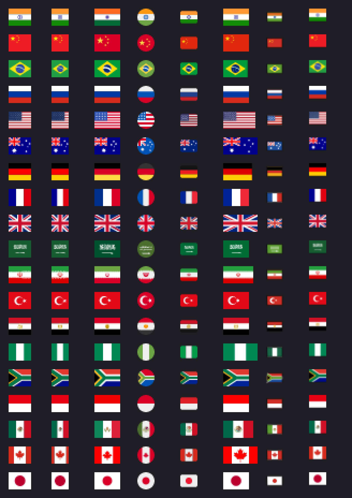
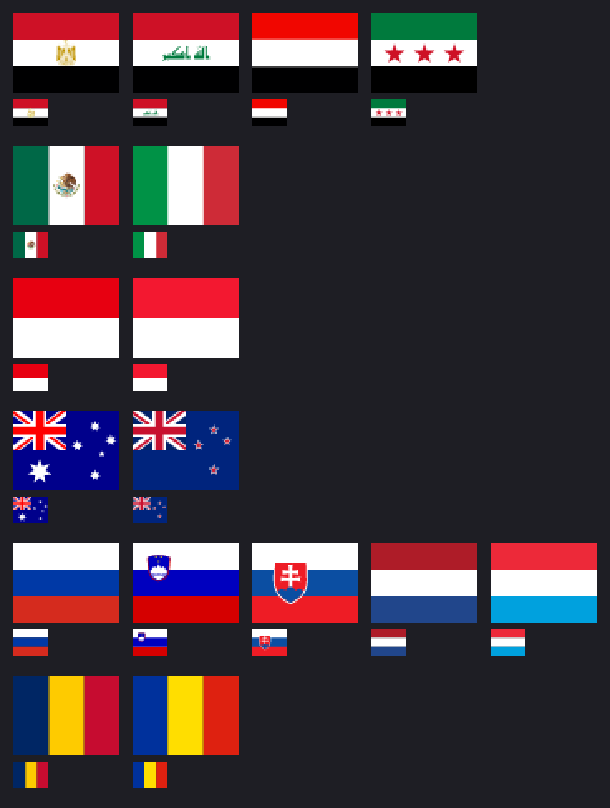

# Flag art under a licence the game can use, legible at sixteen pixels

Research for ticket [#123](https://github.com/whaleyjoshua2/Dying-Earth/issues/123), version 0.07.2.
The designer's line: *"Nation should be referred to as the primary power of the region and title card
should display flag next to name"*.

What the game needs: the flag of each region's primary power, drawn **16 to 22 pixels tall beside
the region's name** on its card. Around fourteen flags now, and any country that may be chosen
later. The repository has no flag art.

## What the game can actually load

Since version 0.07.0 the game renders **SVG at runtime** through `resvg` 0.45.1 (`src/icons.rs`),
rasterised once into an `egui` texture; PNG still loads through the `image` crate. So any SVG set is
a drop-in, and every set below was rendered for this ticket with the game's own `resvg` version.
Two things about the present loader matter for a flag, though, and neither is a licence question:

- **It renders into a 64-pixel square and shows the result as a square.** A 4:3 flag would come out
  drawn across the top of that square, with a strip of nothing under it. A 1:1 flag fits as it is.
- **It tints every icon** with the figure's fill, and an unknown name gets the neutral off-white
  (`icons::fill`), which would multiply a flag's colours down. A flag is not tintable: it needs a
  short loader of its own that draws it untinted, at its own aspect, at the size the card wants. That
  is a small job, and the pictures below show what each choice of size looks like when it is done.

The renderer loads **no fonts**, so an SVG that draws lettering with a `<text>` element would render
it blank. Every set below draws its lettering (Brazil's motto, Saudi Arabia's shahada) as paths, so
none is affected.

## The candidates

### 1. flag-icons (lipis) — MIT, both ratios, the most-used set

- **Licence: MIT.** Copyright (c) 2013 Panayiotis Lipiridis. Read first-hand in the repository's
  `LICENSE`. It grants use, copying, modification and sale "without restriction", on one condition:
  the copyright notice and the permission notice "shall be included in all copies or substantial
  portions of the Software".
- **Attribution: in the shipped files, not on screen.** MIT wants the notice to travel with the
  copies, so a licence file beside the game (or a line on the Credits screen) satisfies it. Nothing
  has to be visible in play.
- **Commercial use: yes. Modification: yes.**
- **Format: SVG**, 271 files in `flags/4x3/` (`viewBox 0 0 640 480`) and the same codes again in
  `flags/1x1/` (`viewBox 0 0 512 512`). The 1:1 files are **recompositions, not crops**: India's
  chakra sits centred in the square. Codes are ISO 3166-1 alpha-2 plus a few extras (`eu`, `un`,
  `xx`), so any later primary power is a file that already exists. Actively maintained: last push
  July 2026, 12,000 stars.
- **Is a national flag inside it really MIT?** The honest answer is that the *project* says so and
  the per-file history does not. In 2014 the maintainer wrote, in issue #37 "Flags license", that the
  SVGs had come from a since-deleted collection by koppi and "I'm not sure what kind of license I have
  to give them as there were not made/modified by me"; the issue closed without more, and every later
  licence question (#364, #854, #911) is answered by pointing at the MIT file. The *designs* of
  national flags are not copyrightable in most places (see the Commons entries below), so what is at
  stake is only the particular drawing, and ten years of the project's own redrawing and optimising
  have made these its drawings. It is a residual, recorded here so that it is a known one.

### 2. Twemoji — CC BY 4.0, an emoji tile with padding

- **Licence: graphics CC BY 4.0, code MIT.** `LICENSE-GRAPHICS` in `jdecked/twemoji` is the full
  CC BY 4.0 legal code. `jdecked/twemoji` is the maintained continuation (version 17, Unicode 17);
  `twitter/twemoji` is not archived but its README stops at version 14.
- **Attribution: required, and the project says what it will accept.** From its README: "we
  consider the guide a bit onerous and as a project, will accept a mention in a project README or an
  'About' section or footer on a website. In mobile applications, a common place would be in the
  Settings/About section." The game's Credits screen is exactly that. CC BY also asks that a
  modification be indicated, and the padding crop below is one.
- **Commercial use: yes. Modification: yes**, with the change noted.
- **Format: SVG in a 36-by-36 emoji box, and 72-by-72 PNG.** The flag itself occupies rows 5 to 31
  of the 36, so at "16 pixels" the flag is about **11.5 pixels tall** with rounded corners. To draw
  it at a real 16 the viewBox has to be cropped, which is the modification to declare. Some flags
  are simplified by design (Brazil's motto is omitted).

### 3. Wikimedia Commons national flags — public domain, per file, in each flag's true ratio

- **Licence: per file, and each file must be read.** The five checked for this ticket are all public
  domain, each under its own country's rule: India ("consists entirely of information that is common
  property and contains no original authorship"), Brazil (a government work), Mexico ("not eligible
  for protection under the federal copyright law", article 14 VII — which covers the coat of arms on
  the flag), Egypt (expired under Law 82 of 2002) and Saudi Arabia (Royal Decree M/41). Commons'
  own guidance is why the per-file reading matters: for coats of arms, "each specific realization may
  have sufficient originality to attract copyright protection", so a user's drawing of a public-domain
  flag *can* carry its own rights, and the tag on the file is what says it does not.
- **Attribution: none required** for public domain. The drawer's name is in the file history.
- **Every one carries the Insignia notice:** "The use of such symbols is restricted in many countries.
  These restrictions are independent of the copyright status." That is about flag law (India's Flag
  Code, and the like), not copyright; the Saudi page adds a note that the shahada on the flag is also
  used by proscribed groups. None of this stops a game drawing a flag beside a name; it is recorded
  because it is on every page.
- **Format: SVG, large, and each in its real ratio** — Nigeria 2:1, Russia 3:2, the United States
  10:19, Brazil 10:7. Beside a name that means **widths that vary from flag to flag** (visible in the
  Noto column of the pictures below). Files are big because the arms are drawn in full: Mexico's is
  224 KB.
- **A shortcut to a checked set: Noto Emoji's `third_party/region-flags`.** Google's README says
  "Flag images under third_party/region-flags are in the public domain or otherwise exempt from
  copyright", and the folder's own LICENSE says they "were downloaded from Wikipedia and checked to
  be in Public Domain or otherwise exempt from Copyright", naming the ones that rest on a national
  law rather than an explicit tag (Mexico among them). It is the Commons option with the per-file
  reading already done.

### 4. OpenMoji — CC BY-SA 4.0, and the smallest flag in its box

- **Licence: CC BY-SA 4.0**, from `LICENSE.txt` and the project FAQ. Commercial use is allowed.
- **Attribution: required, in their words:** "All emojis designed by OpenMoji – the open-source emoji
  and icon project. License: CC BY-SA 4.0".
- **Share-alike, and what it reaches.** The licence's ShareAlike clause (section 3(b)) applies to
  "Adapted Material", which the licence defines as material "derived from or based upon the Licensed
  Material and in which the Licensed Material is translated, altered, arranged, transformed, or
  otherwise modified". Creative Commons' own FAQ says that putting a licensed work into a
  **collection** does not put the collection under the licence, and that using it "in any media or
  format" is granted — so rendering an OpenMoji flag to a texture inside the game does **not** make
  the game CC BY-SA. Cropping or recolouring the flag file *does* make that file Adapted Material,
  which must then be offered under CC BY-SA. In practice: the cropped flag SVGs would have to be
  published under BY-SA; the game would not. It is more paperwork than any other option and the only
  one with a viral term at all.
- **Format: SVG in a 72-by-72 emoji box, with the flag 62 by 38 inside it** — **53 per cent of the
  height**, so at "16 pixels" the flag is about 8 pixels tall, drawn with a dark outline stroke.
  Cropped, it is a flat, slightly stylised flag. Uncropped it is the worst of the set for this job.

### 5. circle-flags (HatScripts) — MIT, round, drawn for small sizes

- **Licence: MIT.** Copyright (c) 2026 HatScripts, in `LICENSE.md` on the `gh-pages` branch (the
  branch the files are published from). Same terms as flag-icons: notice in the copies, nothing on
  screen.
- **Commercial use: yes. Modification: yes.**
- **Format: SVG, 1:1, 432 files** including subdivisions and language flags, each a 512 square with
  a circular mask (`resvg` rendered the mask correctly). The README's contribution rule is the point
  of the set: every flag is drawn from a palette of **eleven standard colours** plus three special
  cases, so the flat areas stay flat at small sizes. Active: last push July 2026.
- **What it looks like:** a round badge. It is the cleanest column in the 16-pixel picture and also
  the least flag-like; a circle beside a name reads as an avatar. That is a look, and the designer's
  call.

### 6. country-flag-icons (catamphetamine) — MIT, 3:2, minimal by design

- **Licence: MIT.** Copyright (c) 2020 @catamphetamine.
- **Format: SVG, 3:2** (`viewBox 0 0 513 342`), about 1 KB a flag, "Optimized for small size on
  screen (little detail, minimalism)" in the README's words. A 1:1 folder exists.
- **Provenance is the same kind as flag-icons':** the README says the author used "Google image
  search for flag references, and various country flag packs (including FlagKit / flagpack) for
  design ideas", with some taken from Wikipedia or free packs. It renders very like flag-icons at 16
  pixels and adds nothing over it except a third ratio.

## What a flag looks like at sixteen pixels

Nineteen flags were rendered from every set with the game's `resvg` at exactly 16 and 22 pixels
tall, plus a 64-pixel reference, on a panel colour near the game's. The nineteen are **guesses at
candidates** — the obvious powers plus the loaded cases — not a list; the designer's list decides
which of them matter. Rows, top to bottom: India, China, Brazil, Russia, United States, Australia,
Germany, France, United Kingdom, Saudi Arabia, Iran, Turkey, Egypt, Nigeria, South Africa, Indonesia,
Mexico, Canada, Japan. Columns, left to right: flag-icons 4:3, flag-icons 1:1, country-flag-icons
3:2, circle-flags, Twemoji, Noto/Commons, OpenMoji, and last **flag-icons 4:3 through the game's
present path** (a 64 square shrunk by egui) for comparison. The sheets are magnified by nearest
neighbour so each rendered pixel is a visible block; the `-native` files beside them are the true
size.

*[sheet-16px-x6.png](flag-art/sheet-16px-x6.png); true size [sheet-16px-native.png](flag-art/sheet-16px-native.png).
At 22 pixels: [sheet-22px-x5.png](flag-art/sheet-22px-x5.png), [native](flag-art/sheet-22px-native.png).
Reference at 64: [sheet-64px-native.png](flag-art/sheet-64px-native.png).*

What the picture shows, read off it rather than assumed:

- **Survive at 16 in every set:** Russia, Germany, France, Nigeria, Indonesia, Japan, Turkey and
  Canada (the leaf is a red blot, but the white band between red bars is unmistakable); the United
  Kingdom (the crosses alias but it is the Union Jack); the United States (stripes alias, the canton
  reads); China (the big star survives, the four small ones smear); Brazil (green with a yellow
  lozenge and a blue disc — the motto and the stars are gone); India (the tricolour, with the chakra a
  blue dot); South Africa (the Y, coarsely).
- **Dissolve at 16:** **Saudi Arabia** (the shahada becomes white noise on green); **Iran** (the
  emblem a red dot, the Kufic borders a dotted texture — it reads as a green-white-red tricolour);
  **Egypt** (the eagle a yellow speck on red-white-black); **Mexico** (the arms a brown smudge on
  green-white-red); **Australia** (the Southern Cross becomes specks; the canton reads).
- **22 pixels helps at the edges, not at the centre.** Turkey's star appears, the American canton
  resolves, China's small stars come back. Saudi Arabia, Iran, Egypt and Mexico are still emblem-less.
- **The emoji sets shrink the flag inside its box.** The Twemoji and OpenMoji columns are visibly
  smaller than their neighbours at the same nominal size, for the padding reason given above. Cropped,
  they behave like the others.
- **The game's present path is a little softer** than a direct render (compare the last column with
  the first on the United Kingdom and the United States) and top-aligns a 4:3 flag in a square, but
  it is not the difference between legible and not. Rendering at the size drawn is the better habit.

**The control.** A flag that differs from another only by an emblem *should* become indistinguishable
at this size, and the picture below confirms the looking can fail: at 16 pixels Egypt, Iraq and Yemen
are the same flag; Mexico and Italy differ by a smudge; Indonesia and Monaco are identical, as are
Chad and Romania; Russia, Slovenia and Slovakia differ by a dot. (Syria, in the first row, is the
green three-star flag flag-icons has shipped since the 2025 change — a small example of flags being
live things.)

*[confusables-16px-x4.png](flag-art/confusables-16px-x4.png); true size [native](flag-art/confusables-16px-native.png).*

**The consequence, in one line:** for four or five of the likely primary powers the flag at 16
pixels **cannot identify the country on its own**; it can only decorate a name that does. That holds
whichever set is chosen, and it is a fact about flags, not about art quality.

**4:3, 3:2 or 1:1?** The height is what sets the emblem's size, so a square recomposition keeps the
emblem exactly as legible as the 4:3 and merely drops the sides; a circle does the same with a softer
edge. What the ratio decides is the *look* and the *layout*: 4:3 reads as a flag and sits 21 pixels
wide beside a name at 16 tall; 1:1 lines up with the game's 16-by-16 glyph column and reads as a
swatch; a circle reads as a badge. The usual interface answer is **one fixed ratio for every flag**
rather than each flag's true one, so that a column of cards does not have widths wandering from 16
to 32 pixels — the Noto column shows the wander. Which fixed ratio is the designer's; the lean below
is 4:3.

**How the pictures were made:** [flagsheet.rs](flag-art/flagsheet.rs), a short program against
`resvg 0.45` and `image 0.25` — the game's own versions — kept here so the sheets can be regenerated
for any other list of flags.

## The shape of the choice

| | licence | credit needed | ratio(s) | flag inside its box at 16 px | provenance of the drawing |
|---|---|---|---|---|---|
| flag-icons | MIT | notice in the files | 4:3 and 1:1 | 16 px | project's word (issue #37, 2014) |
| circle-flags | MIT | notice in the files | 1:1 round | 16 px, 11-colour palette | project's own drawings |
| country-flag-icons | MIT | notice in the files | 3:2 (1:1 folder) | 16 px | references and other packs |
| Commons / Noto region-flags | public domain, per file | none | each flag's own | 16 px, widths vary | per-file tag, read for you by Noto |
| Twemoji | CC BY 4.0 | **yes, visible** | emoji tile, crop to 4:3 | 11.5 px uncropped | Twitter's own drawings |
| OpenMoji | CC BY-SA 4.0 | **yes, visible**, plus share-alike on cropped files | emoji tile, crop | 8 px uncropped | project's own drawings |

**Recommendation: flag-icons**, from its `flags/4x3/` folder, with `flags/1x1/` as the drop-in
alternative if the designer prefers the square. It is MIT, so it asks nothing on screen; it ships
both ratios already composed, so the ratio question is a folder name and not a drawing job; it covers
every code that a later primary power could need; it renders correctly through the game's `resvg`;
and on the legible flags it is as legible as anything measured, because the limit is the flag and not
the drawing. **The trade-off is provenance:** its claim that every flag drawing is MIT rests on the
project's say-so, with a 2014 admission that the originals came from a collection whose licence the
maintainer did not know, whereas the Commons route gives a per-file tag. If a paper trail per flag
matters more than a fixed ratio and small files, take **Noto's `region-flags`** instead and accept
the varying widths. And whichever set is chosen, the emblem flags will read as plain tricolours at
this size, so the flag should sit *beside* the name and never replace it.

**If a round badge is the look wanted**, circle-flags is the cleanest 16-pixel column in the picture
and equally free of strings; it just is not a flag shape.

**On whether flags are politically loaded in a way an icon set is not:** a flag is a state's own
emblem, so drawing India's over a region that also holds Pakistan and Bangladesh, or one African
state's over forty others, makes a claim about who speaks for the region that a wagon or a
jerrycan never did, and some players will read it as one. The loaded part is the *choice* of primary
power, not the art, and that choice is the designer's to make on the naming ticket.

## What the Credits screen would have to say

- **flag-icons, circle-flags or country-flag-icons (MIT):** nothing is required on screen. The
  copyright line and the permission notice must ship with the game — a `LICENSES` or `THIRD-PARTY`
  text file beside the executable does it, and a Credits line is a courtesy that also happens to be
  the game's existing habit: *"Flags: flag-icons by Panayiotis Lipiridis, MIT licence."*
- **Commons or Noto region-flags:** nothing required. A courtesy line: *"Flags from Wikimedia
  Commons, public domain."*
- **Twemoji:** a visible line, and the crop declared: *"Flags: Twemoji, copyright Twitter and
  contributors, CC BY 4.0 (creativecommons.org/licenses/by/4.0), cropped from their emoji tiles."*
- **OpenMoji:** their wording — *"All emojis designed by OpenMoji – the open-source emoji and icon
  project. License: CC BY-SA 4.0"* — plus publication of the cropped flag files under CC BY-SA.

## Sources

- [flag-icons — LICENSE (MIT)](https://github.com/lipis/flag-icons/blob/main/LICENSE)
- [flag-icons — README](https://github.com/lipis/flag-icons/blob/main/README.md)
- [flag-icons — issue #37 "Flags license" (2014)](https://github.com/lipis/flag-icons/issues/37);
  later: [#364](https://github.com/lipis/flag-icons/issues/364), [#854](https://github.com/lipis/flag-icons/issues/854), [#911](https://github.com/lipis/flag-icons/issues/911)
- [jdecked/twemoji — LICENSE-GRAPHICS (CC BY 4.0)](https://github.com/jdecked/twemoji/blob/main/LICENSE-GRAPHICS)
- [jdecked/twemoji — README, "Attribution Requirements"](https://github.com/jdecked/twemoji/blob/main/README.md)
- [Wikimedia Commons — File:Flag_of_India.svg](https://commons.wikimedia.org/wiki/File:Flag_of_India.svg),
  [Flag_of_Brazil.svg](https://commons.wikimedia.org/wiki/File:Flag_of_Brazil.svg),
  [Flag_of_Mexico.svg](https://commons.wikimedia.org/wiki/File:Flag_of_Mexico.svg),
  [Flag_of_Egypt.svg](https://commons.wikimedia.org/wiki/File:Flag_of_Egypt.svg),
  [Flag_of_Saudi_Arabia.svg](https://commons.wikimedia.org/wiki/File:Flag_of_Saudi_Arabia.svg)
- [Wikimedia Commons — Template:Insignia](https://commons.wikimedia.org/wiki/Template:Insignia)
- [Wikimedia Commons — Copyright rules by subject matter, coats of arms](https://commons.wikimedia.org/wiki/Commons:Copyright_rules_by_subject_matter)
- [Noto Emoji — README, licensing](https://github.com/googlefonts/noto-emoji/blob/main/README.md)
- [Noto Emoji — third_party/region-flags/LICENSE](https://github.com/googlefonts/noto-emoji/blob/main/third_party/region-flags/LICENSE)
- [OpenMoji — LICENSE.txt (CC BY-SA 4.0)](https://github.com/hfg-gmuend/openmoji/blob/master/LICENSE.txt)
- [OpenMoji — FAQ, licence and attribution](https://openmoji.org/faq/)
- [Creative Commons — BY-SA 4.0 legal code, sections 1(a) and 3(b)](https://creativecommons.org/licenses/by-sa/4.0/legalcode.en)
- [Creative Commons — FAQ, collections and formats](https://creativecommons.org/faq/)
- [circle-flags — LICENSE.md (MIT)](https://github.com/HatScripts/circle-flags/blob/gh-pages/LICENSE.md)
- [circle-flags — README](https://github.com/HatScripts/circle-flags/blob/gh-pages/README.md)
- [country-flag-icons — LICENSE (MIT)](https://github.com/catamphetamine/country-flag-icons/blob/master/LICENSE)
- [country-flag-icons — README](https://github.com/catamphetamine/country-flag-icons/blob/master/README.md)
- [Unicode — Emoji FAQ, flags](https://unicode.org/faq/emoji_dingbats.html) ("The Unicode Consortium
  has no control nor influence over the designs of region flags")
- Counts and dates from the GitHub API on 2026-09-12: flag-icons 271 files in `flags/4x3`, circle-flags
  432 in `flags/`, last pushes July–August 2026 for all four repositories.
